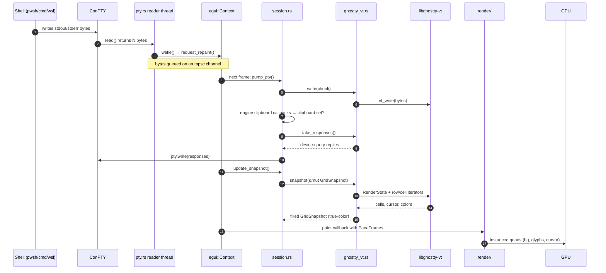
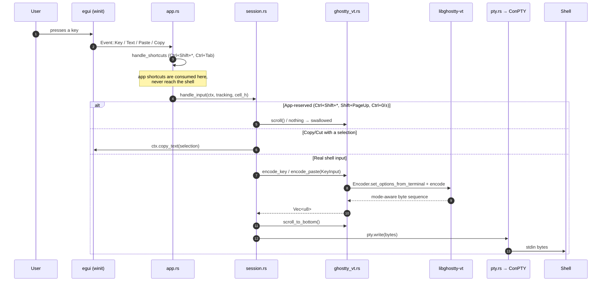
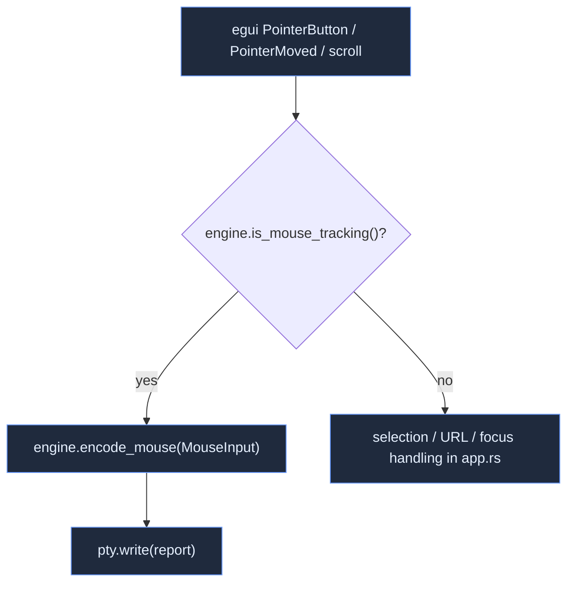

# Data flow

Two round trips capture almost everything geist does: a **keystroke going out**
to the shell, and a **chunk of output coming back** to the screen. Both pass
through the same narrow boundaries described in [Layered design](layers.md).

## Output: shell → screen

When the shell writes bytes, ConPTY delivers them on a background reader thread,
which wakes the UI. On the next egui frame the bytes are parsed by libghostty-vt
and the resulting grid is snapshotted and painted.

Key facts:

- The reader thread **never blocks the UI**; it only enqueues bytes and calls
  `wake()`.
- `take_responses()` drains bytes libghostty wants written back (replies to
  device-status queries etc.) and the session flushes them to the PTY — closing
  the loop without the renderer ever being involved.
- The engine resolves all colors to RGB and pre-applies `inverse` during
  `snapshot`, so `render/` reads a fully-resolved grid.

## Input: keystroke → shell

egui hands geist already-classified events. `session.rs` decides whether each
event is for the **app** (tabs, splits, scrollback, copy/paste) or the
**shell**, and only the latter is encoded to bytes and written to the PTY.

Key facts:

- **Ctrl+Shift+\*** is the app's namespace and is never sent to the shell.
- The key encoder reads the terminal's **live modes** (cursor-key application
  mode, kitty keyboard protocol, modifyOtherKeys) via
  `set_options_from_terminal`, so the same physical key encodes differently
  depending on what the program enabled.
- Typing calls `scroll_to_bottom()` first, matching Ghostty's "scroll to bottom
  on input."

## Mouse reporting

When the running program enables mouse tracking, pointer events are encoded
instead of driving selection:

The encoder is fed cell size, grid pixel size, and pointer pixel position, and
produces the report for whatever protocol the app selected (X10 / SGR 1006,
with wheel mapped to buttons 4/5).
