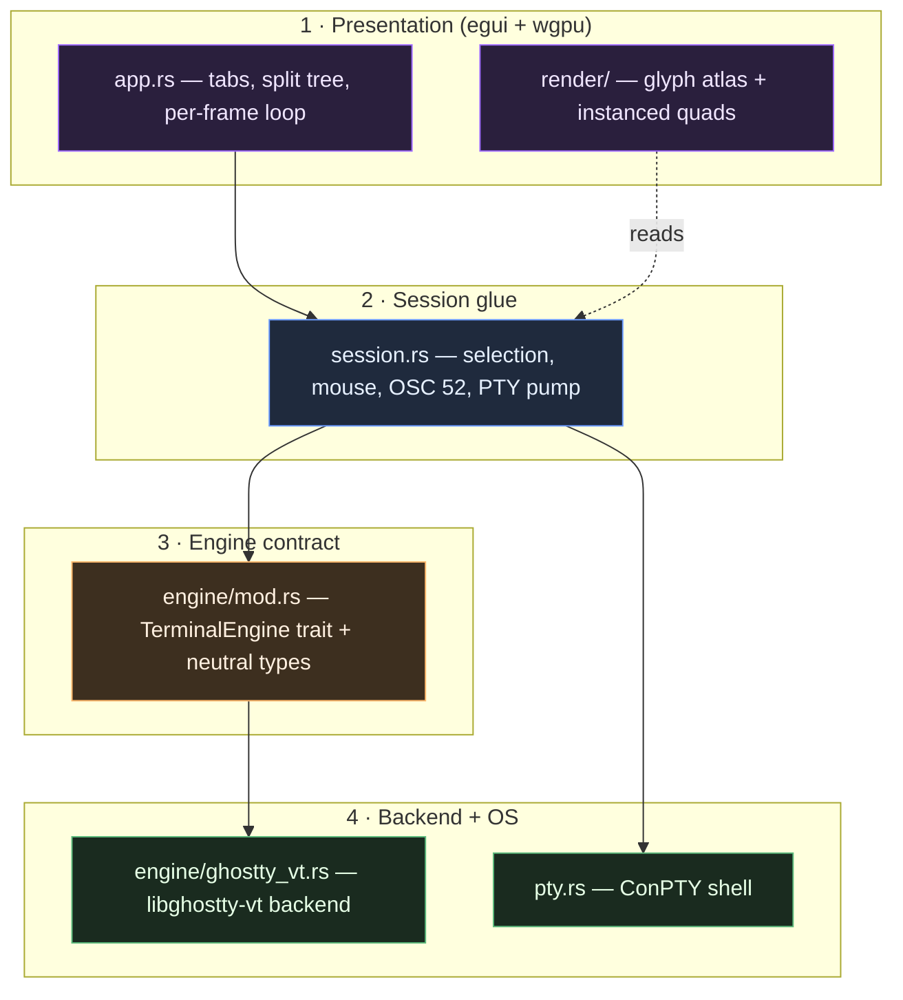
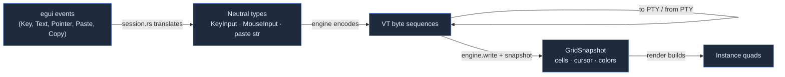

# Layered design

giest has four conceptual layers. Data crosses each boundary in a deliberately
narrow shape, which is what keeps the renderer and input code free of any
libghostty or Windows specifics.

## 1 · Presentation

`app.rs` is the eframe `App`. Every frame it:

1. Pumps PTY output into each pane's engine.
2. Reaps panes/tabs whose shell exited.
3. Handles app-level shortcuts (tabs, splits, focus, font zoom).
4. Lays the focused tab's split tree out into rects.
5. Routes keyboard to the focused pane and mouse/selection interactions.
6. Builds a `PaneFrame` per pane and paints them all in **one** wgpu callback.

`render/` turns each `GridSnapshot` into instanced quads (cell backgrounds,
shaped glyphs sampled from the atlas, cursor) and submits them to the GPU.

## 2 · Session glue

`session.rs` owns the bits that are neither pure rendering nor pure terminal
state: the selection anchor/head, the held mouse button, the alive flag, and
the OSC 52 scanner. `pump_pty` drains PTY output into the engine and flushes
the engine's responses back to the PTY. It also translates egui events into the
neutral `KeyInput` / `MouseInput` values the engine encodes.

## 3 · Engine contract

[`engine/mod.rs`](../components/engine.md) defines the **only** vocabulary the
upper layers share with the terminal model:

- **Inputs:** `write(bytes)`, `encode_key`, `encode_mouse`, `encode_paste`,
  `resize`, `scroll*`, `apply_theme`, `set_cursor_color`.
- **Outputs:** `snapshot(&mut GridSnapshot)`, `take_responses`, `title`,
  `is_mouse_tracking`.

The engine resolves palette indices and the default fg/bg to **concrete RGB**,
and pre-applies `inverse`, so the renderer only ever deals in true color.

## 4 · Backend + OS

`engine/ghostty_vt.rs` is the sole bridge to libghostty-vt. `pty.rs` is the
sole bridge to the Windows ConPTY shell. Swapping either one out (a different
VT engine, a different PTY transport) is a localized change — nothing above
layer 3 references them by name.

## The data that crosses each boundary

