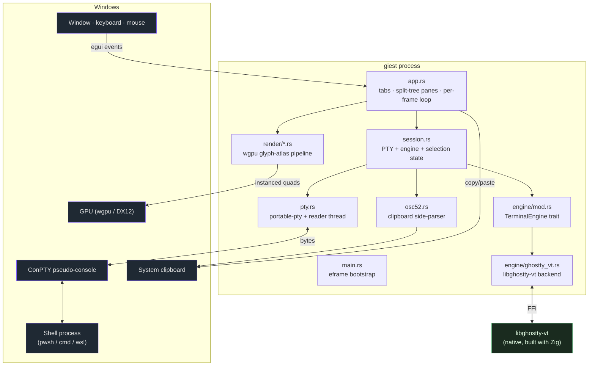

# Architecture overview

giest is layered so that the **renderer and input layer never touch
libghostty-vt directly** — they only ever talk to the backend-neutral
[`TerminalEngine`](../components/engine.md) trait. This leaves room for a
pure-Rust fallback engine in the future without changing the rest of the app.

## The big picture

## Source map

| Module | Responsibility |
| --- | --- |
| `main.rs` | eframe bootstrap; configures the wgpu renderer and window, constructs `App`. |
| `app.rs` | The eframe `App`. Owns a `Vec<Tab>`; each tab is a **binary split tree** of panes with one focused leaf. Routes input → PTY, sizes grids, drives the per-frame loop, paints all panes in one GPU callback. |
| `session.rs` | One session = a `Pty` + a `GhosttyVtEngine` + per-pane interaction state (selection, held mouse button, alive flag, OSC 52 scanner). |
| `engine/mod.rs` | The `TerminalEngine` trait and neutral types (`GridSnapshot`, `Cell`, `KeyInput`, `MouseInput`, `Rgb`). |
| `engine/ghostty_vt.rs` | The only libghostty-vt implementation of the trait. |
| `pty.rs` | ConPTY shell via portable-pty, with a reader thread that wakes the UI on output. |
| `render/mod.rs` | wgpu instanced-quad pipeline, per-row run shaping, instance builder, egui `CallbackTrait`. |
| `render/atlas.rs` | rustybuzz shaping + ab_glyph rasterization into an R8 atlas; COLR/CPAL color emoji into an RGBA atlas. |
| `config.rs` | TOML config from `%APPDATA%\giest\config.toml`; the full ANSI 16 + 256-color palette. |
| `profiles.rs` | Shell profiles (pwsh / powershell / cmd / wsl). |
| `osc52.rs` | Side-stream parser for OSC 52 clipboard-set. |

## Why the layering matters

The arrow from `app.rs`/`session.rs` into the terminal model **stops at the
trait boundary** (`engine/mod.rs`). The renderer consumes a `GridSnapshot` of
neutral types — true-color `Rgb`, plain `bool` style flags, `CompactString`
grapheme clusters — and never imports anything from `libghostty_vt`. Likewise
the input layer produces neutral `KeyInput` / `MouseInput` values; only
`engine/ghostty_vt.rs` knows how to turn those into libghostty calls.

The next page breaks the layers down in detail, and
[Data flow](data-flow.md) traces one keystroke and one chunk of shell output
all the way through.
