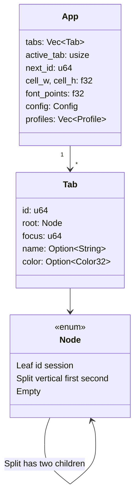
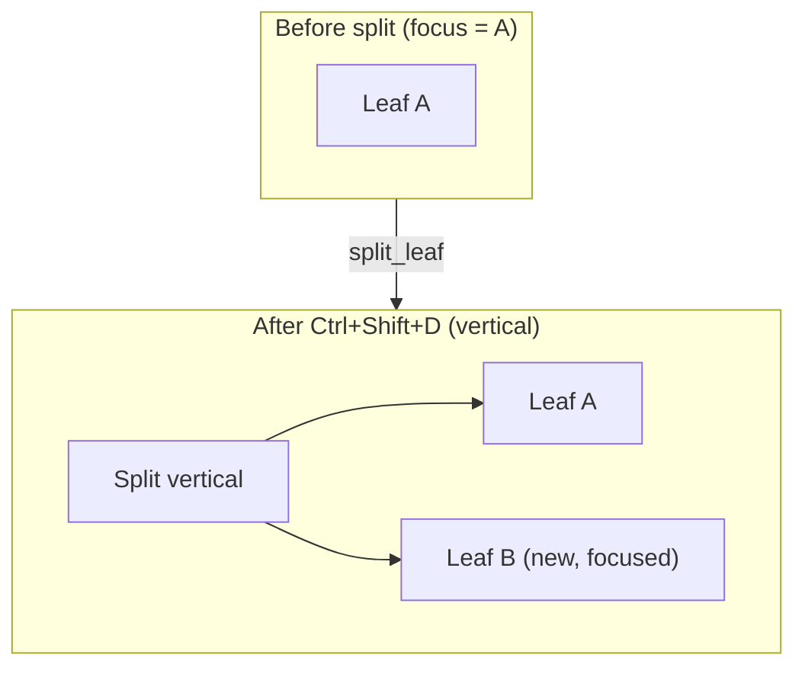
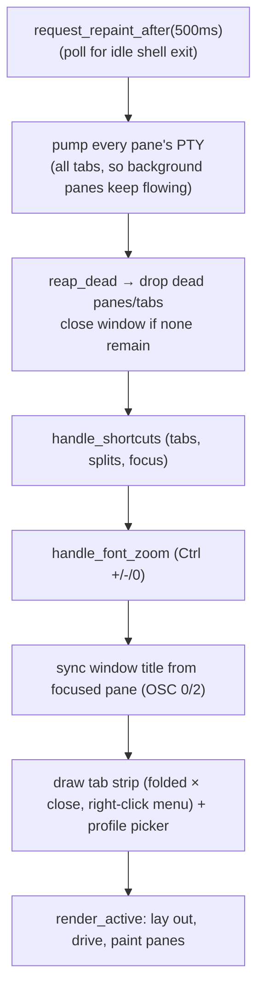
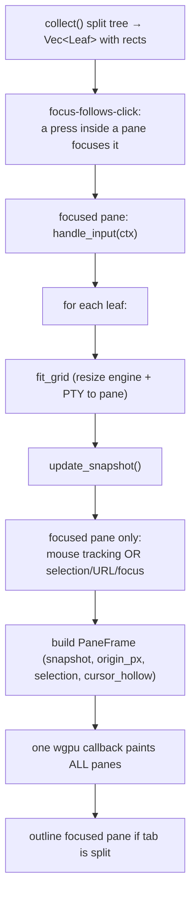

# `app.rs` — window, tabs & panes

`app.rs` is the eframe `App`: it owns the tabs, the split-tree of panes inside
each tab, the shared cell metrics, and the per-frame loop that drives and paints
everything.

## Tabs and the split tree

A `Tab` is a **binary split tree** of panes with one focused leaf. Splits divide
only the *focused* pane, so they nest like Ghostty rather than re-flowing onto a
shared axis. Each tab also carries an optional `name` (a rename override, set via
the right-click menu's "Rename Tab…"; otherwise the label tracks the focused pane's
terminal title) and an optional `color` tint.

The tab strip's right-click context menu (in `tab_bar`) mirrors Ghostty: New Tab /
New Tab with shell, Rename Tab…, Tab Color (`TAB_COLORS` palette), and Close
Tab / Close Other Tabs (`keep_only_tab`) / Close Tabs to the Right
(`truncate_tabs_to_right`). The `×` close is folded into each tab; new tabs come
from the `⏷` chevron or the menu (there's no standalone `+`).

`Node` operations are pure tree transforms:

- `split_leaf` — replace the focused leaf with a `Split` of the old pane + a new
  leaf.
- `detach_leaf` / `attach_at` — take a leaf *out of* the tree and put it back
  where it was. `detach_leaf` collapses the split that lost a child into its
  survivor (what a close does) and hands back the removed subtree with a
  `PaneSlot` — the path to its old parent, the axis, and which side it was on;
  `attach_at` re-creates that split. This is the pair `undo` is built on: the
  pane is *moved*, so its shell keeps running the whole time.
- `prune` — drop every leaf whose shell exited, collapsing splits. Unlike
  `detach_leaf` this one really discards, because there is nothing left to keep.
- `collect` — divide a rect by each split's axis (1px gutter) and emit a `Leaf`
  (id, session, rect) per pane.

Tabs carry a stable `id` from the same monotonic counter as the leaf ids. Every
*index* into `tabs` goes stale on a reorder or a reap (see CLAUDE.md), which is
survivable for state held within a frame; an undo entry outlives far more than a
frame, so it addresses tabs by id.

## Undo and redo

`App` owns one [`undo::UndoStack`](../../src/undo.rs) spanning every window —
app-scoped rather than per-window because a *window* close is itself undoable,
and a stack living on the window that closed would go with it.

Its entries are `UndoOp`s, and the vocabulary is deliberately symmetric: three
`Restore*` variants that own removed panes/tabs/windows (**with their sessions
still alive**) and three `Remove*` variants that take them back out. Applying
either kind returns the op that reverses it, and the stack files that return
value onto the opposite pile — so `undo`, `redo`, and undoing a *creation* are
all the same two code paths walked in different directions, with no third
"opposite of this" free to drift.

Windows raise them the same way they raise everything else app-scoped: a
`AppRequest::Record(op)` on the per-pass `requests` vector, which is also how a
removed `Tab<Session>` gets out of the window that closed it.

Entries expire on `undo-timeout` (default 5 s) and `App::ui` prunes them every
pass, not just when undo is used — an expired entry is holding shells open, and
they should end when it does.

## The per-frame loop

`eframe::App::ui` runs once per frame:

### `render_active` in detail

Notable behaviors:

- **One GPU callback for all panes.** Every visible pane's `PaneFrame` is handed
  to a single `egui_wgpu::Callback`, so they share one instance buffer.
- **Focus lock.** The focused pane requests egui focus and locks Tab + arrow
  keys to itself, so egui's built-in focus traversal can't steal Tab (which the
  shell wants) or fire a tab-strip button on a following Enter/Space.
- **Hollow cursor.** Only the focused pane of a focused window gets a solid,
  blinking cursor; every other visible cursor is drawn hollow
  (`cursor_hollow`), matching Ghostty.
- **Pixel snapping.** The grid origin is snapped to the physical pixel grid so
  cell boundaries land on pixels and glyphs stay crisp.
- **Pane mouse actions (right/middle click).** In the *non-tracking* branch of a
  focused pane, right-click runs `right-click-action` (default `context-menu`:
  Copy / Paste / Split Right / Split Down / Select All / Reset Terminal; the
  Split items defer to `self.split` past the `leaves` borrow via a `want_split`
  flag) and middle-click runs `middle-click-action` (default pastes the
  clipboard). Both live in the `else` of the `tracking` check, so a program
  capturing the mouse receives the clicks instead and no menu appears — matching
  Ghostty. Config: `right-click-action` / `middle-click-action`.

## Keyboard shortcut ownership

`handle_shortcuts` (app-level) and `Session::handle_input` (shell-level)
partition the keyboard:

| Keys | Owner | Effect |
| --- | --- | --- |
| Ctrl+Shift+T / W | app | new / close tab (or pane) |
| Ctrl+Shift+D or O / E | app | split right (columns) / split down (rows) |
| Ctrl+Shift+1–9 | app | jump to tab (9 = last) |
| Ctrl+Tab / Ctrl+Shift+Tab | app | cycle tabs |
| Ctrl+ +/-/0 | app | font zoom in/out/reset |
| Shift+PageUp/Down/Home/End | session→engine | scrollback |
| everything else | session→engine | encoded to the shell |
