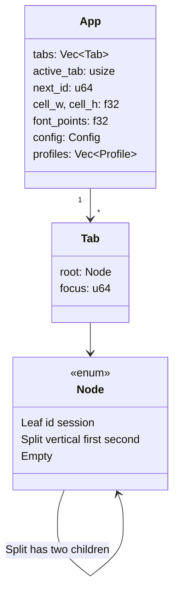
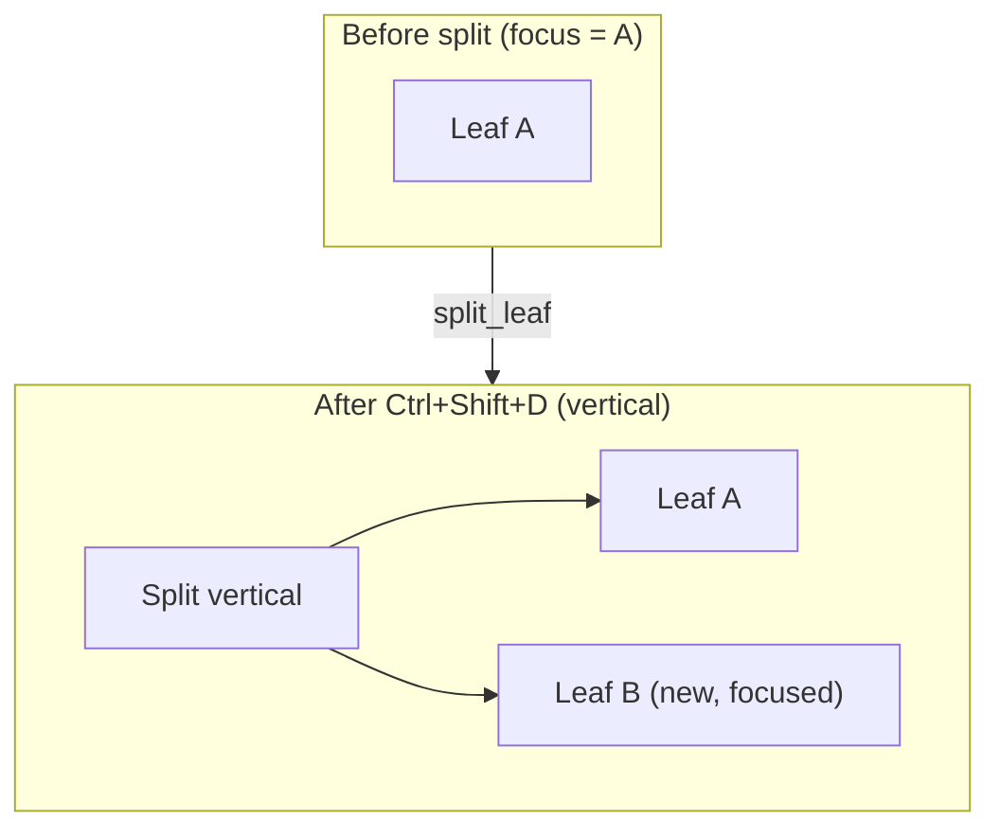
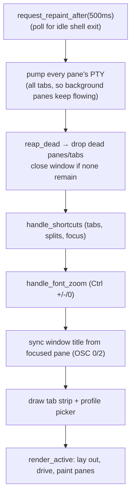
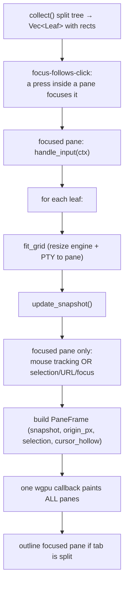

# `app.rs` — window, tabs & panes

`app.rs` is the eframe `App`: it owns the tabs, the split-tree of panes inside
each tab, the shared cell metrics, and the per-frame loop that drives and paints
everything.

## Tabs and the split tree

A `Tab` is a **binary split tree** of panes with one focused leaf. Splits divide
only the *focused* pane, so they nest like Ghostty rather than re-flowing onto a
shared axis.

`Node` operations are pure tree transforms:

- `split_leaf` — replace the focused leaf with a `Split` of the old pane + a new
  leaf.
- `remove_leaf` / `prune_dead` — drop a leaf (closed, or its shell exited),
  collapsing a split into its surviving child.
- `collect` — divide a rect by each split's axis (1px gutter) and emit a `Leaf`
  (id, session, rect) per pane.

## The per-frame loop

`eframe::App::ui` runs once per frame:

### `render_active` in detail

Notable behaviors:

- **One GPU callback for all panes.** Every visible pane's `PaneFrame` is handed
  to a single `egui_wgpu::Callback`, so they share one instance buffer.
- **Focus lock.** The focused pane requests egui focus and locks Tab + arrow
  keys to itself, so egui's built-in focus traversal can't steal Tab (which the
  shell wants) or fire a tab-strip button on a following Enter/Space.
- **Hollow cursor.** Only the focused pane of a focused window gets a solid,
  blinking cursor; every other visible cursor is drawn hollow
  (`cursor_hollow`), matching Ghostty.
- **Pixel snapping.** The grid origin is snapped to the physical pixel grid so
  cell boundaries land on pixels and glyphs stay crisp.

## Keyboard shortcut ownership

`handle_shortcuts` (app-level) and `Session::handle_input` (shell-level)
partition the keyboard:

| Keys | Owner | Effect |
| --- | --- | --- |
| Ctrl+Shift+T / W | app | new / close tab (or pane) |
| Ctrl+Shift+D / E | app | split vertical / horizontal |
| Ctrl+Shift+1–9 | app | jump to tab (9 = last) |
| Ctrl+Tab / Ctrl+Shift+Tab | app | cycle tabs |
| Ctrl+ +/-/0 | app | font zoom in/out/reset |
| Shift+PageUp/Down/Home/End | session→engine | scrollback |
| everything else | session→engine | encoded to the shell |
