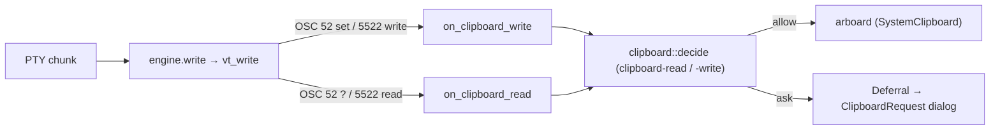

# `clipboard.rs` — program clipboard access (OSC 52 + OSC 5522)

Programs running in the terminal can read and write the system clipboard with
**OSC 52** (tmux, vim/nvim `+clipboard`, remote shells over SSH) and the **kitty
clipboard protocol, OSC 5522** (multi-MIME reads/writes with status replies,
plus *paste events*, mode 5522).

libghostty-vt parses both protocols and calls two effect callbacks with one
normalized request per read or write. giest installs them in
`engine/ghostty_vt.rs` (`install_clipboard`); `clipboard.rs` is the policy half.
There is no side-scanner any more — the old `osc52.rs` existed only because the
binding used to expose neither the payload nor a callback.

## Policy

| Config | Effect |
|---|---|
| `clipboard-write = allow / deny / ask` | OSC 52 set and 5522 write |
| `clipboard-read = allow / deny / ask` | OSC 52 `?` and 5522 read |
| `clipboard-write-limit-bytes` | an oversized write is refused (`EPERM` for 5522) |

MIME types: Windows' clipboard is text, so `text/plain` (and the spellings
`text/plain;charset=utf-8`, `UTF8_STRING`, `TEXT`, `STRING`) are served. A write
keeps its text representation and drops the others; a write with *no* text
representation is `ENOSYS`. A read gets one representation per requested text
type and nothing for the rest, which is how the protocol reports "not there".
A bare targets listing (`.`) is served without a prompt, as kitty and upstream do.

## `ask` without blocking

The callbacks are synchronous and an unanswered request is refused on the spot.
giest cannot block on a modal (the UI thread draws it), so for `ask` the
callback records the response-buffer offset and leaves the request unanswered;
after `vt_write` the refusal the engine wrote there is **cut back out** and held.
On the user's answer: deny sends the held refusal; allow performs the write and
sends it flipped to `DONE`, or **replays** the read into the engine with a
one-shot grant so the engine formats the real reply. See the module docs.

## Paste events (mode 5522)

With mode 5522 on, `Session::paste_str` sends a paste *event* (MIME listing +
one-time password) via `ghostty_terminal_paste` instead of typing the text; the
program's follow-up read arrives with `granted` set and is served the pasted
text, whatever `clipboard-read` says. Paste protection doesn't apply there:
nothing is typed into the program.
