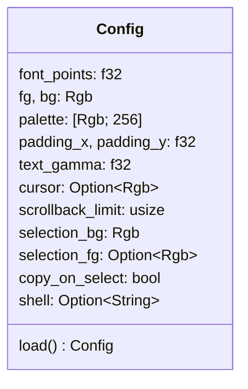
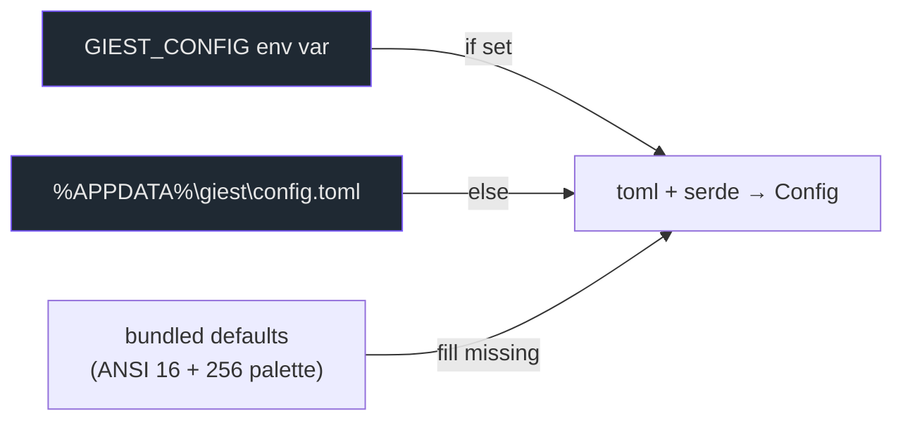
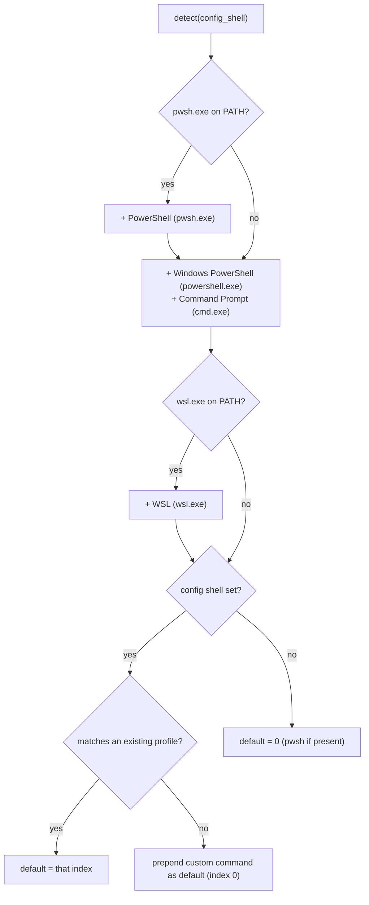

# `config.rs` & `profiles.rs`

These two modules handle startup configuration: what the terminal looks like
(`config.rs`) and which shell it runs (`profiles.rs`).

## `config.rs` — the TOML config

On startup giest reads `%APPDATA%\giest\config.toml` (override the path with the
`GIEST_CONFIG` environment variable). All keys are optional; missing ones fall
back to the bundled defaults, which include the full ANSI 16 + 256-color
palette.

Where each field is consumed:

| Field | Consumed by |
| --- | --- |
| `font_points`, `text_gamma` | `render::init` (atlas + shader) |
| `fg`, `bg`, `palette` | `engine.apply_theme` |
| `cursor` | `engine.set_cursor_color` |
| `padding_x/y` | `app::render_active` (per-pane inset) |
| `scrollback_limit` | `GhosttyVtEngine::new` |
| `selection_bg/fg`, `copy_on_select` | `app::render_active` / `TermFrame` |
| `shell` | `profiles::detect` |

See [Configuration](../guides/configuration.md) for the full annotated TOML.

## `profiles.rs` — shell profiles

A `Profile` is a launchable shell: a display name plus the program + args to
spawn. `detect` probes what's installed and picks a default, Windows-Terminal
style.

- `which()` splits `PATH` to find `pwsh.exe` / `wsl.exe`. `powershell.exe` and
  `cmd.exe` are assumed always present on Windows.
- `Profile::matches` is case- and `.exe`-insensitive, matching by display name
  or program, so `shell = "cmd"`, `"CMD"`, or `"cmd.exe"` all select Command
  Prompt.
- An **unknown** `shell` value (e.g. a full path to `bash.exe`) is **prepended**
  as a new default profile.

The profile picker (`▾` menu in the tab strip) lets you open a tab running any
detected profile; the `+` button and Ctrl+Shift+T use the default.
