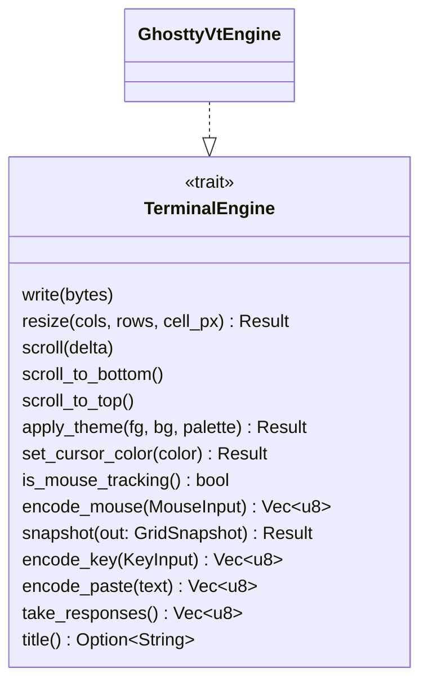
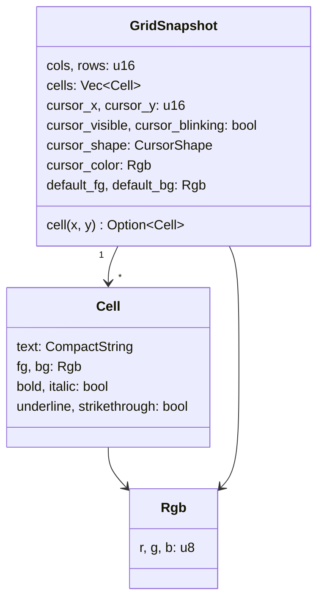
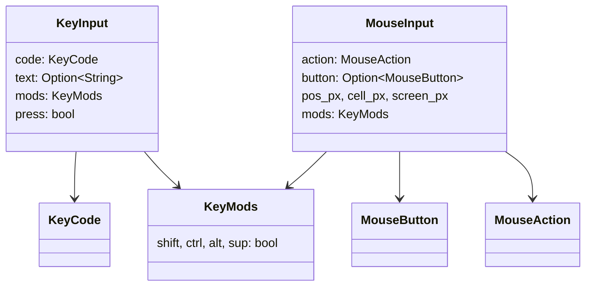

# `engine` — the VT trait

`engine/mod.rs` defines the **backend-agnostic terminal contract** and the
neutral types that cross it. `engine/ghostty_vt.rs` is the single libghostty-vt
implementation. The renderer and input layer only ever see this module — never
libghostty itself.

## The `TerminalEngine` trait

Methods split into three groups:

- **Feed in:** `write`, `resize`, `scroll*`, `apply_theme`, `set_cursor_color`.
- **Encode out:** `encode_key`, `encode_mouse`, `encode_paste`.
- **Read out:** `snapshot`, `take_responses`, `title`, `is_mouse_tracking`.

## Neutral types

Design notes baked into these types:

- **True color only.** The engine resolves palette indices and default fg/bg to
  concrete `Rgb`, so the renderer never resolves a palette. `inverse` is
  **pre-applied** to each cell's `fg`/`bg`.
- **No per-cell heap allocation.** `Cell::text` is a
  [`CompactString`](https://crates.io/crates/compact_str): grapheme clusters of
  ≤24 bytes (the overwhelming majority) live inline on the stack, so building and
  cloning the per-frame snapshot doesn't allocate per cell.
- **Reused snapshot.** `snapshot(&mut GridSnapshot)` clears and refills a buffer
  the caller owns, rather than returning a fresh one each frame. The
  implementation resizes the `cells` vec and clears each cell's string buffer in
  place.

### Input types

`KeyCode` is named after the W3C `KeyboardEvent.code` values libghostty's
encoder uses, listing only the subset giest translates; printable text is
delivered separately via `KeyInput::text`. `MouseButton::WheelUp/WheelDown` map
to buttons 4/5.

## Why a trait at all?

The trait is the seam for a future **pure-Rust fallback engine**. Because every
caller speaks only `TerminalEngine` + neutral types, dropping in a second
implementation would not touch `app.rs`, `session.rs`, or `render/`. It also
makes the libghostty boundary auditable: see
[the libghostty touch point](../touchpoints/libghostty.md).
