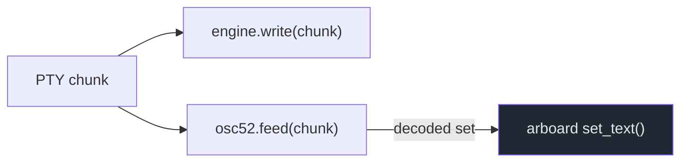
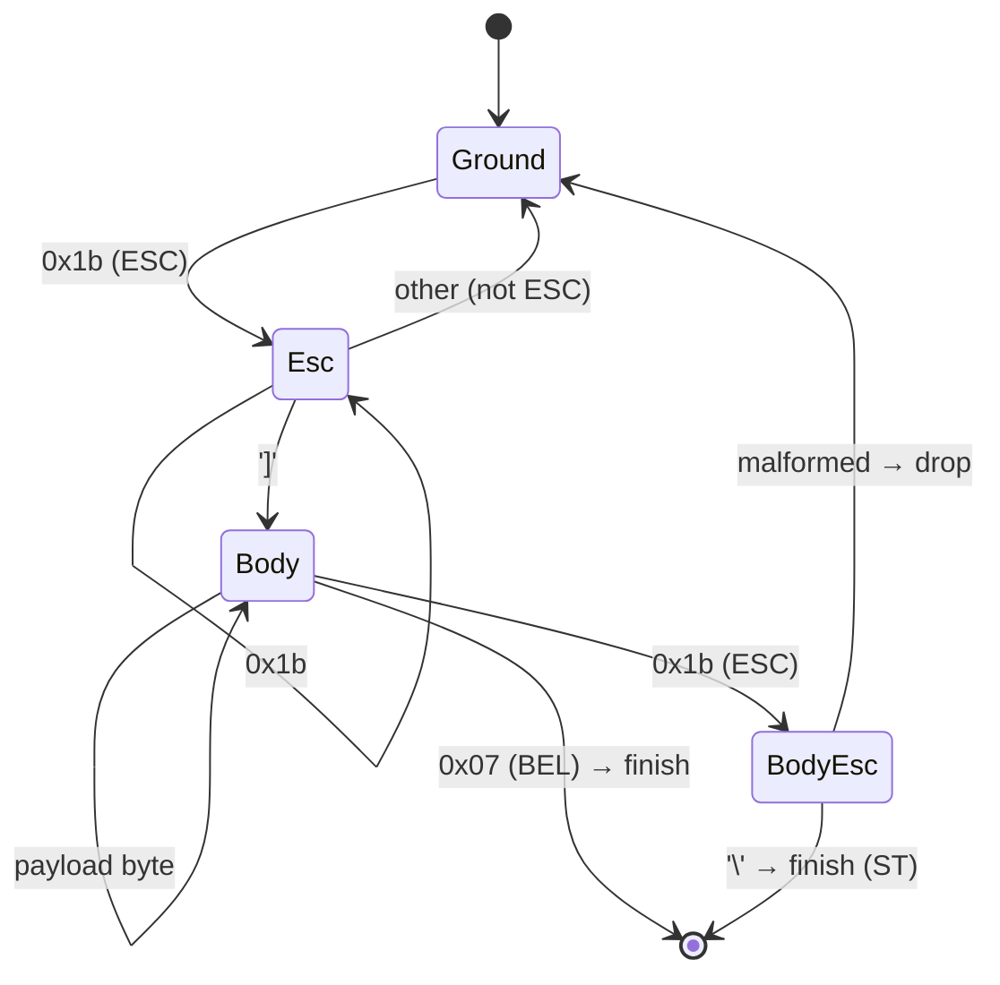

# `osc52.rs` — OSC 52 clipboard

OSC 52 lets a program running in the terminal **set the system clipboard** —
e.g. tmux, vim/nvim with `+clipboard`, or a remote shell over SSH. giest
supports the *set* form by scanning the PTY byte stream itself.

## Why a separate parser?

libghostty-vt parses OSC 52, but the Rust binding surfaces only the command
*type*, not its base64 payload, and offers no callback. So giest runs a **tiny
streaming parser over the same bytes** it feeds the engine, decodes the base64,
and writes the result to the clipboard.



This is the one place terminal-protocol parsing is duplicated outside
libghostty, and it exists purely because the binding doesn't expose the data.

## The sequence

```
ESC ] 52 ; <targets> ; <base64>  (BEL | ESC \)
```

Only the **set** form is handled. A query (`<base64>` == `?`) is **ignored** so
terminal output can't read the clipboard back out (a deliberate
information-leak guard).

## Streaming state machine

`Osc52Scanner::feed` consumes arbitrary chunks — a single sequence may span
multiple PTY reads — and emits decoded strings as complete sequences arrive.



On `finish`, the buffered body is parsed: strip the `52;` prefix, split off the
targets, base64-decode the payload, and (if valid UTF-8) emit the string.
`session::pump_pty` then writes the **last** set to win to the clipboard.

## Safety bounds

- A single OSC body is capped at **1 MiB** (`MAX_BODY`); a malformed,
  never-terminated sequence sets an `overflowed` flag and is abandoned rather
  than growing the buffer without bound.
- A query payload (`?`) is dropped before any clipboard access.

The scanner is covered by unit tests for BEL- and ST-terminated sets,
chunk-split sequences, query rejection, the primary (`p`) target, and ignoring
unrelated OSC sequences (e.g. OSC 0 title).
