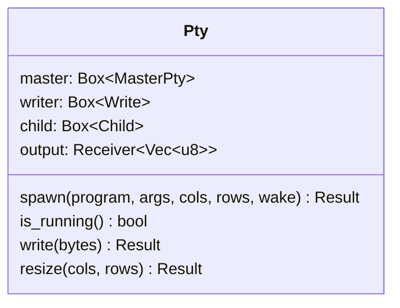
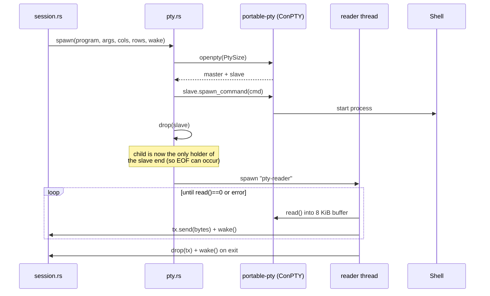
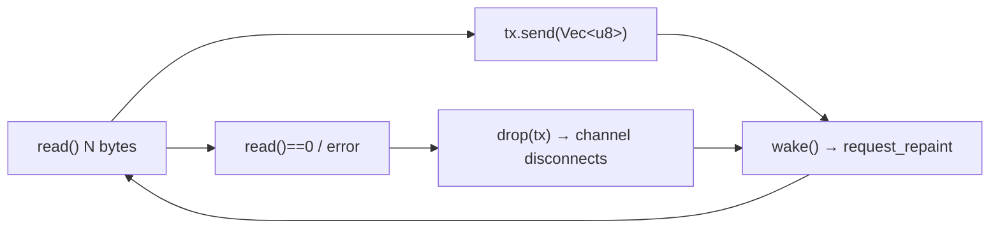

# `pty.rs` — the ConPTY shell

`pty.rs` is the **only** file that touches the PTY. It spawns a shell on a
ConPTY pseudo-console (via [`portable-pty`](https://crates.io/crates/portable-pty)),
streams its output on a background thread, and writes input/responses back.

## The `Pty` struct

## Spawn sequence

Why `drop(pair.slave)`: the slave handle must be dropped so the **child** is the
only holder; otherwise the read side never sees EOF when the shell exits.

## The reader thread

A dedicated thread named `pty-reader` blocks on `read()` so the UI thread never
does. On each successful read it enqueues the bytes on an `mpsc` channel and
calls `wake()` (which the session wires to `ctx.request_repaint()`). When the
shell closes its output it drops the sender — disconnecting the channel —  and
wakes the UI one last time.

## Detecting exit — the ConPTY caveat

!!! warning "`read()` may never return 0 on ConPTY"
    On Windows ConPTY the master *output* pipe usually does **not** reach EOF
    when the child exits — portable-pty keeps the pseudoconsole open, so the
    reader thread stays blocked and the channel never disconnects. giest's
    primary exit signal is therefore `is_running()`, which polls the child
    process directly with `Child::try_wait()`. `app.rs` schedules a repaint
    every 500 ms so an idle exit is still reaped. See [Gotchas](../gotchas.md).

## Resize

`resize(cols, rows)` calls `master.resize(PtySize { … })`. The session calls
this alongside `engine.resize` whenever `fit_grid` decides the pane's grid
dimensions changed, keeping the PTY's idea of the window in sync with the
rendered grid.
