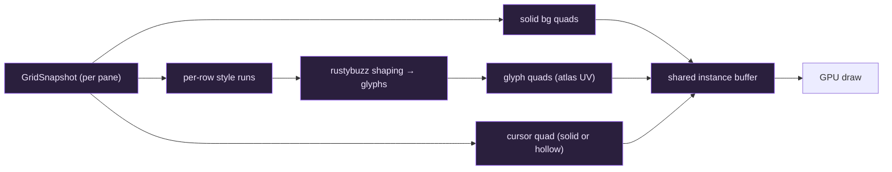
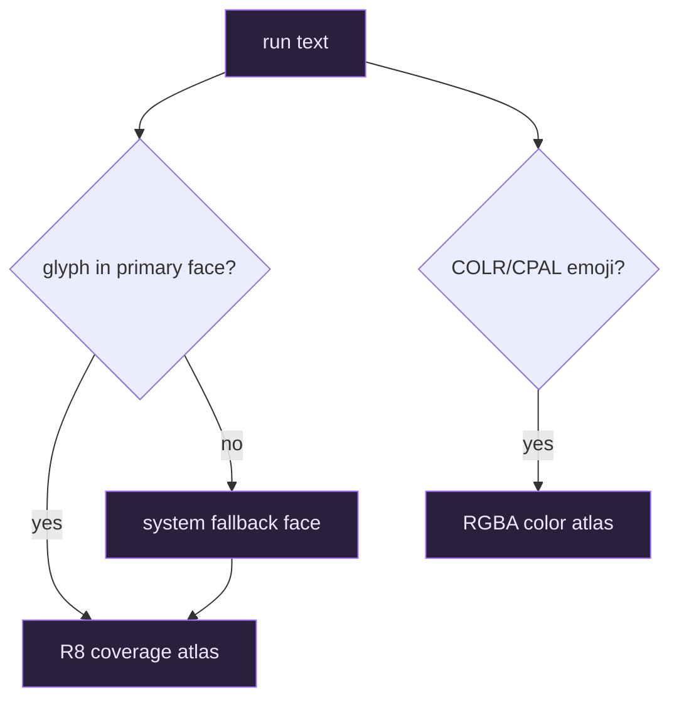
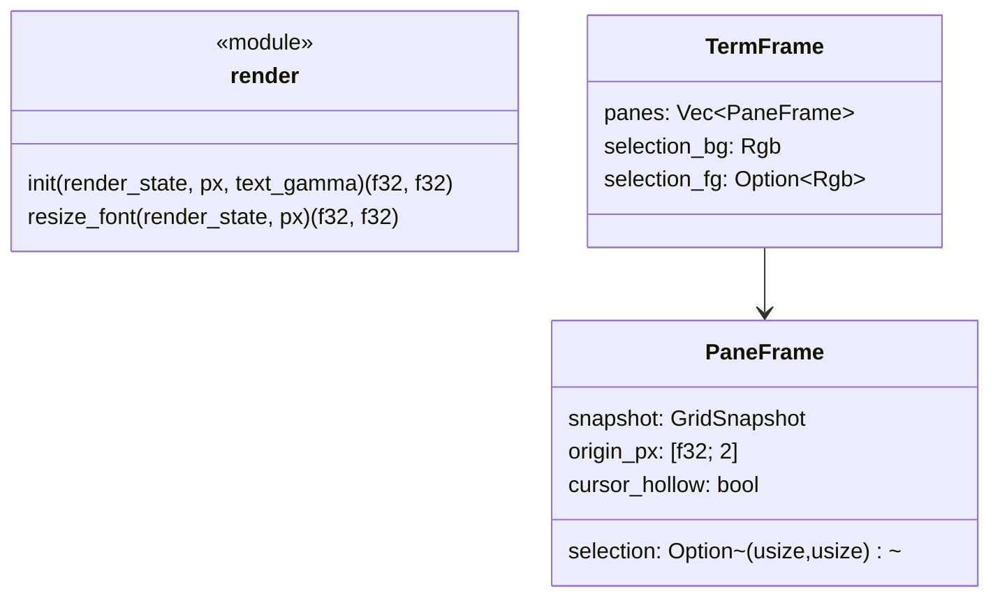

# `render` — the wgpu pipeline

The renderer turns a `GridSnapshot` into pixels using a single **instanced-quad
wgpu pipeline**, driven from inside an egui paint callback. It is split into
`render/mod.rs` (pipeline + instance building) and `render/atlas.rs` (shaping +
rasterization).

## What gets drawn

Every visible thing is a quad instance with a `mode`:

- `mode = 0` — **solid fill**: cell backgrounds, the cursor, selection
  highlights.
- `mode = 1` — **glyph**: alpha sampled from the **R8 coverage atlas** (binding
  1).
- color emoji sample the separate **RGBA color atlas** (binding 3).

## Per-row run shaping

Cells are grouped into **maximal horizontal runs** that share fg color and
style (`GlyphRun`). Each run's text is shaped once with
[rustybuzz](https://crates.io/crates/rustybuzz) so ligatures (`=>`, `!=`, `->`,
`==`, …) and contextual alternates resolve, then each shaped glyph's cluster is
snapped back to its **origin grid column** via `byte_cell` — keeping glyphs on
the monospace grid while still benefiting from shaping.

## The atlas

`render/atlas.rs`:

- Shapes with rustybuzz, rasterizes with
  [ab_glyph](https://crates.io/crates/ab_glyph) into an **R8** coverage atlas.
- Uses a **primary face** (JetBrains Mono Nerd Font) plus **system fallback
  faces** for characters the primary font lacks (CJK, many symbols).
- Composites **COLR/CPAL** color emoji layers (e.g. Segoe UI Emoji) into a
  separate **RGBA** atlas.

## GPU resources

`GpuResources` (stored in egui's `callback_resources`) holds the pipeline, bind
group, uniform buffer, quad corners/indices, the instance buffer, both atlas
textures, and **reusable per-frame scratch buffers** that are cleared (not
reallocated) so building the instance list does no per-frame growth allocation.

The bind group layout:

| Binding | Resource |
| --- | --- |
| 0 | uniform buffer (viewport size, gamma) |
| 1 | R8 coverage atlas texture |
| 2 | filtering sampler |
| 3 | RGBA color (emoji) atlas texture |

## Public API

- `init` builds the pipeline and atlas and returns the monospace **cell size in
  physical pixels**, which `app.rs` uses to size every pane's grid.
- `resize_font` re-rasterizes the atlas at a new pixel size (Ctrl +/-/0 zoom)
  and returns the new cell size.
- `TermFrame` (implementing egui's `CallbackTrait`) carries **all** panes of the
  active tab, so one callback paints them on a shared instance buffer.

## Pixel-perfect output

The cell size is integer (the atlas ceils it), and `app.rs` snaps each pane's
grid origin to the physical pixel grid, so every cell boundary lands on a pixel
— no anti-aliased seams between rows/cells, and glyphs stay crisp. A
configurable **text gamma** is passed to the shader (as its reciprocal) to tune
anti-aliasing thickness for light-on-dark text.
