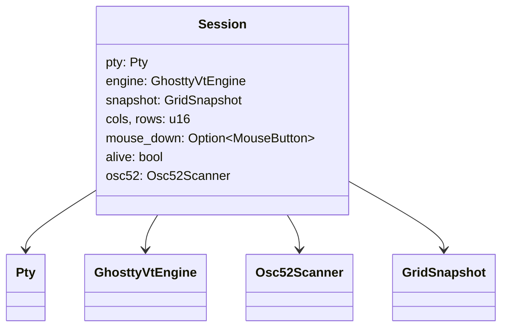
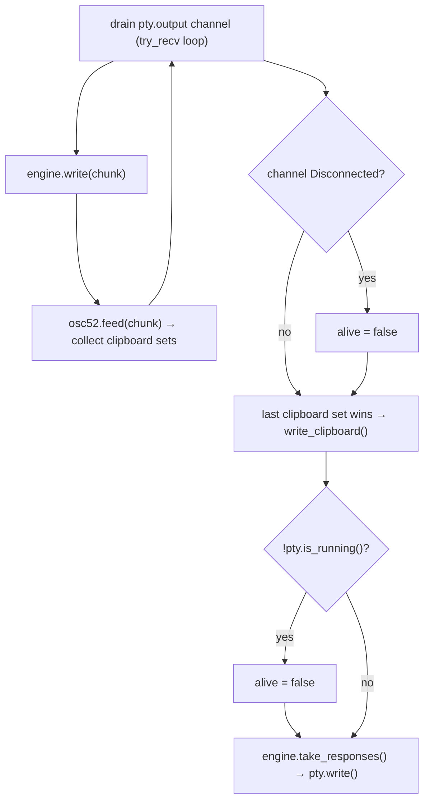
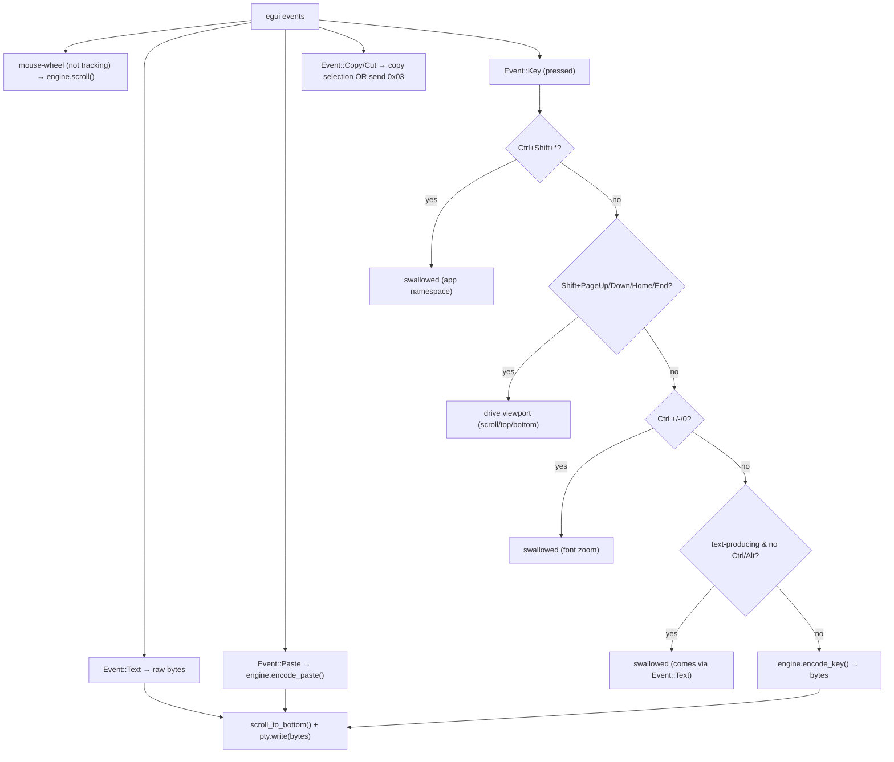

# `session.rs` — one terminal session

A `Session` is one terminal: a shell on a PTY, its libghostty-vt engine, and the
per-pane interaction state. `app.rs` holds one `Session` per pane (leaf).

## `pump_pty` — the I/O heartbeat

Called for **every** pane each frame (so background panes keep flowing):

Two independent exit signals are checked: the channel disconnecting **and**
`pty.is_running()` returning false. The latter is the primary signal on Windows
because ConPTY often won't EOF the pipe (see
[Gotchas](../gotchas.md)).

## `handle_input` — keyboard, text, paste, scroll

Translates egui events to PTY bytes, claiming app-reserved combos along the way.

!!! note "Windows-Terminal copy semantics"
    `Event::Copy` copies the selection if one exists (and clears it); with no
    selection it sends `0x03` (SIGINT). Both Ctrl+C and Ctrl+Shift+C arrive as
    `Event::Copy` because egui-winit pre-translates them — see
    [Gotchas](../gotchas.md).

## `handle_mouse` — reporting to the program

Only runs when the program enabled mouse tracking. Converts egui pointer events
to `MouseInput` (with cell/screen pixel geometry) and asks the engine to encode
a report, including synthesized wheel "notches."

## Selection, words, lines, URLs

When the program is **not** tracking the mouse, `app.rs` drives selection
through these helpers:

| Gesture | Method | Behavior |
| --- | --- | --- |
| drag | `begin_selection` / `update_selection` | anchor + moving end |
| double-click | `select_word` | the terminal's own word boundaries (`selection-word-chars`) |
| triple-click | `select_line` | the logical line, following soft wrapping, stopping at a prompt |
| Ctrl+triple-click | `select_output` | the command's output, from its OSC 133 marks |
| Shift+click | `extend_selection` | extend an existing selection |
| Ctrl+click | `url_at` → `find_url_at` | open a URL under the cursor |

**The selection itself is not stored here.** It lives in the VT engine, which
holds the drag anchor as a *tracked* grid reference and installs the range into
the terminal — so it follows its cells through scrolling, scrollback eviction and
reflow, which viewport `(col,row)` pairs never could. `Session` keeps only the
interaction state (`mouse_down`, click counts).

`selection_text` therefore reads through the engine: it spans scrollback and
unwraps soft wrapping, and `clipboard-trim-trailing-spaces` is the formatter's
own `trim` flag. The renderer doesn't compute selection either — each `Cell`
carries `selected`, filled from the render state's row-local range.
