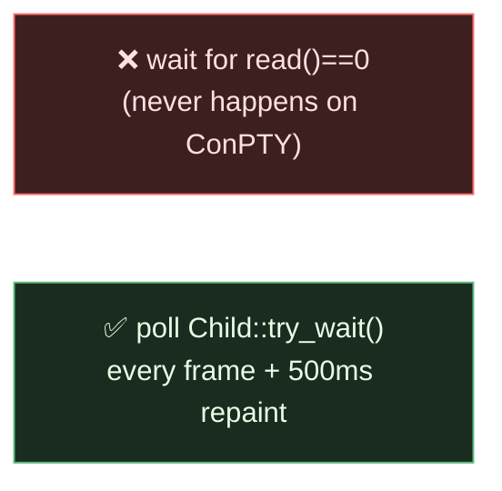
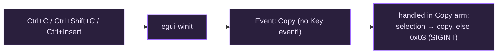

# Gotchas

The non-obvious, platform-specific traps that shape giest's design. Each is a
place where the "obvious" approach is wrong on Windows / ConPTY / egui /
libghostty.

## ConPTY doesn't EOF when the child exits

On Windows ConPTY the master *output* pipe usually does **not** reach EOF when
the child exits — portable-pty keeps the pseudoconsole open, so the reader
thread stays blocked on `read()` and its channel never disconnects.

**Fix:** detect exit by polling the child process directly
(`Pty::is_running` → `Child::try_wait`), not by `read() == 0`. `app.rs` also
calls `request_repaint_after(500ms)` so an idle exit still gets reaped (drop
dead panes → drop emptied tabs → close window on the last tab).



See [`pty.rs`](components/pty.md).

## The Windows static-link patch

`vendor/libghostty-rs/` is vendored from
[Uzaaft/libghostty-rs](https://github.com/Uzaaft/libghostty-rs) (`@9bf2bd29`)
**specifically to apply one patch**. On Windows, upstream's
`static=ghostty-vt` resolves to the DLL **import lib**, making the exe depend on
`ghostty-vt.dll` — whose runtime path crashes (access violation in `vt_write`).
The patched `build.rs` links `static=ghostty-vt-static` (the real archive) on
Windows.

!!! danger "Don't 'simplify' this back to the upstream form"
    Upstream's Windows CI only **builds**, never **runs**, so it never hit the
    DLL-path crash. Reverting the patch produces a binary that compiles and then
    crashes on first VT write.

See the [libghostty touch point](touchpoints/libghostty.md).

## Zig version is pinned to 0.15.2

The pinned Ghostty commit declares `minimum_zig_version = 0.15.2`. **0.16.x will
not build it.** `mise.toml` pins `zig = "0.15.2"`; prefer the `mise dev` /
`mise release` tasks, which put the right Zig on `PATH`.

## The release profile feeds the Zig build via `DEBUG`

`Cargo.toml`'s `[profile.release]` is tuned for max speed (`lto = "fat"`,
`codegen-units = 1`, `panic = "abort"`, `strip`). The trap is the **`debug`**
flag: Cargo passes a profile's `debug` setting to build scripts as the `DEBUG`
env var, and `libghostty-vt-sys/build.rs` reads it — `DEBUG=true` switches the
Zig VT library from `ReleaseFast` to a **slow `Debug` build**.

**Implication:** never add `debug = true` to `[profile.release]` to get profiling
symbols — it silently halves engine throughput. Use a dedicated profile instead:

```toml
[profile.profiling]
inherits = "release"
debug = true   # only here; this profile's DEBUG=true is the price of symbols
```

`panic = "abort"` also means a panic anywhere (including the PTY reader thread)
aborts the process rather than unwinding — intended, and safer across the
libghostty-vt FFI boundary. `cargo test`/`cargo bench` still build with unwind.

## Always run cargo from the project root

Running cargo from inside `vendor/libghostty-rs/...` builds the **vendored
crate** instead of giest (cargo walks up to the nearest `Cargo.toml`). A
"Finished" that only mentions `libghostty-vt` compiling means you're in the
wrong directory.

## Clipboard keys are pre-translated by egui-winit

`egui_winit` converts copy/cut/paste shortcuts into
`Event::Copy` / `Event::Cut` / `Event::Paste(contents)` and returns **without**
emitting a raw `Event::Key`. Its `is_copy_command` ignores Shift, so **both**
Ctrl+C and Ctrl+Shift+C arrive as `Event::Copy`.

**Implication:** copy/paste logic must live in the `Event::Copy/Cut/Paste`
arms, not the `Key` handler (that would be dead code).



Windows-Terminal semantics: `Event::Copy` copies the selection if one exists,
otherwise sends `0x03` (SIGINT). See [`session.rs`](components/session.md).

## OSC 52 payload isn't exposed by the binding

libghostty-vt parses OSC 52 but the Rust binding surfaces only the command
*type*, not its base64 payload, and offers no callback. So giest runs its **own**
side-stream parser ([`osc52.rs`](components/osc52.md)) over the same bytes it
feeds the engine. OSC 52 *write* is supported this way; OSC 52 *read/query* is
intentionally **not** answered, to avoid leaking the clipboard to terminal
output.

## `on_pty_write` must not re-enter the terminal

libghostty's `on_pty_write` callback (used for device-query replies etc.) must
not call back into the terminal. giest's callback therefore only pushes bytes
into a shared `Rc<RefCell<Vec<u8>>>` sink; `take_responses()` drains it after
each `write` and the session flushes it to the PTY.

## Focus lock so the shell keeps Tab

The focused pane requests egui focus and locks Tab + arrow keys to itself.
Otherwise egui's built-in focus traversal swallows **Tab** (which the shell
wants for completion) to cycle the tab-strip buttons, and a following
Enter/Space fires whichever button got focus — switching or closing tabs
unexpectedly. See [`app.rs`](components/app.md).

## Themed default background only shows where unset

The configured **default background** only shows where the shell hasn't erased
with an explicit background. The palette and default foreground apply to all
colored output; a program that paints its own background covers the theme bg.
