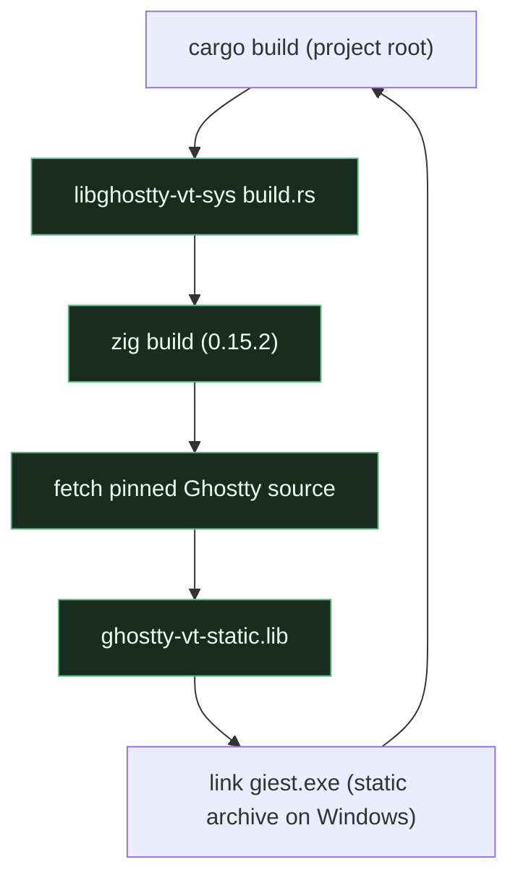

# Building & testing

## Prerequisites

- **Rust** — stable, edition 2024 (1.95+).
- **Zig 0.15.2** on `PATH`. The vendored `libghostty-vt-sys` build script
  compiles Ghostty's VT library with Zig. The pinned Ghostty commit declares
  `minimum_zig_version = 0.15.2`, so **0.16.x will not build it**. Get it from
  <https://ziglang.org/download/0.15.2/>.
- **MSVC toolchain** — the default `x86_64-pc-windows-msvc` target.
- **Internet on the first build** — the build script fetches the pinned Ghostty
  source.

## Recommended: mise

The repo ships a `mise.toml` that pins `zig = "0.15.2"` and defines tasks that
run cargo from the project root with the right Zig on `PATH`.

```powershell
mise trust      # once
mise dev        # debug build + run
mise release    # optimized release build
```

## Cargo directly

```powershell
# Put Zig 0.15.2 first on PATH:
$env:PATH = "C:\path\to\zig-0.15.2;$env:PATH"

cargo run             # debug
cargo run --release   # release
```

Fallbacks: `mise exec zig@0.15.2 -- cargo build`, or plain
`cargo build`/`cargo run --release` if Zig 0.15.2 is already on `PATH`.

!!! warning "Always run cargo from the project root"
    Running cargo from inside `vendor/libghostty-rs/...` builds the **vendored
    crate** instead of giest (cargo walks up to the nearest `Cargo.toml`). A
    "Finished" that only mentions `libghostty-vt` compiling means you're in the
    wrong directory.

The first build takes a few minutes (it fetches and compiles Ghostty's VT
library via Zig); later builds skip Zig unless the native crate changes.

## What the build does



See the [libghostty touch point](../touchpoints/libghostty.md) for why the
Windows link targets the static archive rather than the DLL import lib.

## Tests

```powershell
cargo test          # ~31 unit tests
cargo test <name>   # single test by name substring
```

Coverage spans the engine, input encoding, selection, paste, mouse encoding,
theming, config parsing, ligatures, OSC 52 parsing, and URL detection — the
pure-logic seams that don't need a window or a GPU.

## Building these docs

```bash
pip install -r docs/requirements.txt
mkdocs serve     # live preview at http://127.0.0.1:8000
mkdocs build     # static site → ./site
```

The site uses Material for MkDocs; diagrams are [Mermaid](https://mermaid.js.org/)
fenced blocks rendered client-side via the theme's built-in support.
