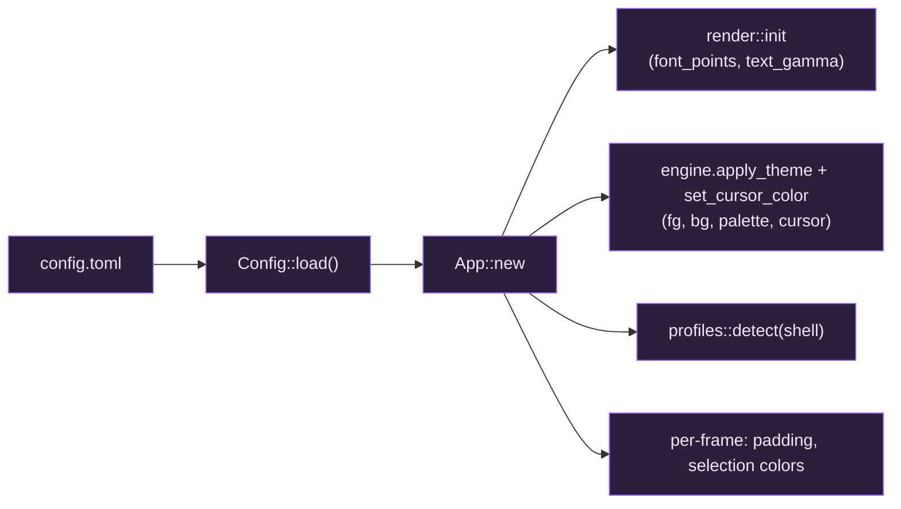

# Configuration

giest reads `%APPDATA%\giest\config.toml` on startup. Override the path with the
`GIEST_CONFIG` environment variable. **Every key is optional** — anything you
omit falls back to the bundled default, which includes the full ANSI 16 +
256-color palette.

## Full annotated example

```toml
shell        = "pwsh"     # default shell: name (pwsh/powershell/cmd/wsl) or a
                          # full path; unset auto-detects (PowerShell 7 preferred)
font_points  = 16.0       # logical font size (scaled by display DPI)
foreground   = "#c5c8c6"  # default text color
background   = "#101218"  # default background color
cursor_color = "#c5c8c6"  # cursor color (omit to defer to the program/default)
padding_x    = 2.0        # logical-point padding left/right of the grid
padding_y    = 2.0        # logical-point padding above/below the grid
text_gamma   = 1.3        # text AA gamma; >1 thickens light-on-dark text (0.5–3.0)

scrollback_limit = 10000  # max scrollback lines retained per pane

selection_background = "#385a9c"  # selected-cell background
selection_foreground = "#ffffff"  # text color over a selection (optional)
copy_on_select       = false      # copy to clipboard as soon as text is selected

# Palette overrides, Ghostty-style ("<index>=#rrggbb"):
palette = ["0=#101218", "1=#cc6666", "8=#666a73"]
```

## How a value reaches the screen



## Field reference

| Key | Type | Effect |
| --- | --- | --- |
| `shell` | string | Default shell: a profile name, program, or full path. Unknown values become a new default profile. |
| `font_points` | float | Logical font size; scaled by DPI, then rasterized into the glyph atlas. Also the reset target for Ctrl+0. |
| `foreground` / `background` | `#rrggbb` | Default fg/bg, applied via `engine.apply_theme`. |
| `cursor_color` | `#rrggbb` | Cursor color; omit to defer to the program/engine default. |
| `padding_x` / `padding_y` | float | Per-pane inset in logical points (wraps every split, not just the window edge). |
| `text_gamma` | float (0.5–3.0) | Anti-aliasing gamma passed to the shader; >1 thickens light-on-dark text. |
| `scrollback_limit` | int | Max scrollback lines retained per pane. |
| `selection_background` | `#rrggbb` | Background of selected cells. |
| `selection_foreground` | `#rrggbb` | Text color over a selection (optional; omit to keep each cell's own fg). |
| `copy_on_select` | bool | Copy to the clipboard as soon as a selection completes. |
| `palette` | array of `"<index>=#rrggbb"` | Override individual 256-color palette entries; everything else keeps the bundled theme. |

## Runtime adjustments (no config edit)

| Keys | Effect |
| --- | --- |
| Ctrl+= / Ctrl+- | grow / shrink the font (re-rasterizes the atlas) |
| Ctrl+0 | reset the font to `font_points` |

Font bounds are clamped to 6–48 logical points.
