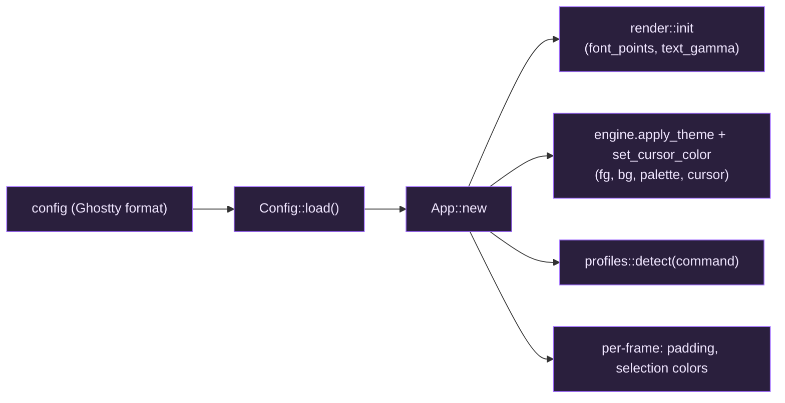

# Configuration

giest reads `%APPDATA%\giest\config` on startup. Override the path with the
`GIEST_CONFIG` environment variable. The file uses **Ghostty's config format**,
so keys are transposable with a real Ghostty config:

- `key = value`, one per line, **kebab-case** keys.
- Colors are **unquoted** hex: `background = #1d1f21` (a leading `#` is part of
  the color, not a comment).
- Lines whose first non-blank character is `#` are comments. Ghostty has no
  inline comments.
- `palette` is **repeatable** — one `palette = <index>=#rrggbb` line per entry.
- An **empty value** (`key =`) resets that key to its built-in default.
- **Every key is optional**, and keys giest doesn't support (e.g. `font-family`,
  `theme`) are ignored with a warning — so a full Ghostty config can be dropped
  in and the supported subset applies.

## Full annotated example

```ini
command          = pwsh        # default shell: name (pwsh/powershell/cmd/wsl) or
                               # a full path; unset auto-detects (PowerShell 7)
font-size        = 16          # logical font size (scaled by display DPI)
foreground       = #c5c8c6     # default text color
background       = #101218     # default background color
cursor-color     = #c5c8c6     # cursor color (omit to defer to the program)
window-padding-x = 2           # logical-point padding left/right of the grid
window-padding-y = 2           # logical-point padding above/below the grid
text-gamma       = 1.3         # text AA gamma; >1 thickens light-on-dark (0.5–3.0)

scrollback-limit = 10000       # max scrollback lines retained per pane

selection-background = #385a9c # selected-cell background
selection-foreground = #ffffff # text color over a selection (optional)
copy-on-select       = false   # copy to clipboard as soon as text is selected
right-click-action   = context-menu  # context-menu | copy | paste | copy-or-paste | ignore
middle-click-action  = primary-paste # primary-paste | ignore

# Palette overrides — repeat the key, one entry per line:
palette = 0=#101218
palette = 1=#cc6666
palette = 8=#666a73
```

## Field reference

| Key | Type | Effect |
| --- | --- | --- |
| `command` | string | Default shell: a profile name, program, or full path. Unknown values become a new default profile. (Ghostty `command`.) |
| `font-size` | float | Logical font size; scaled by DPI, then rasterized into the glyph atlas. Also the reset target for Ctrl+0. |
| `foreground` / `background` | `#rrggbb` | Default fg/bg, applied via `engine.apply_theme`. |
| `cursor-color` | `#rrggbb` | Cursor color; omit to defer to the program/engine default. |
| `window-padding-x` / `window-padding-y` | float | Per-pane inset in logical points (wraps every split, not just the window edge). |
| `text-gamma` | float (0.5–3.0) | Anti-aliasing gamma passed to the shader; >1 thickens light-on-dark text. **giest-specific** — Ghostty has no equivalent. |
| `scrollback-limit` | int | Max scrollback **lines** retained per pane. Note: Ghostty's `scrollback-limit` is in *bytes*; giest's VT engine takes a line count, so the key matches but the unit differs. |
| `selection-background` | `#rrggbb` | Background of selected cells. |
| `selection-foreground` | `#rrggbb` | Text color over a selection (optional; omit to keep each cell's own fg). |
| `copy-on-select` | enum | `false` off; `true`/`clipboard`/`primary` copy on selection. Windows has no primary selection, so the three truthy values behave identically. |
| `right-click-action` | enum | What a right-click in a pane does: `context-menu` (default; Copy/Paste/Split/Select All/Reset), `copy`, `paste`, `copy-or-paste` (copy if a selection exists, else paste), or `ignore`. Suppressed while a program is capturing the mouse. |
| `middle-click-action` | enum | `primary-paste` (default) pastes the clipboard; `ignore` does nothing. Windows has no primary selection, so this reads the system clipboard. |
| `palette` | repeated `<index>=#rrggbb` | Override individual 256-color palette entries; everything else keeps the bundled theme. |

### Transparency and opacity

| Key | Type | Notes |
| --- | --- | --- |
| `background-opacity` | float 0–1 (default `1.0`) | Window background opacity. Only cells left on the *default* background go translucent — a program that paints its own background (Neovim, tmux) stays opaque by design. **Changing this across the `1.0` boundary needs a restart**: whether the window can be transparent at all is fixed when the surface is created. The value itself reloads live. |
| `background-opacity-cells` | bool (default `false`) | Extend `background-opacity` to cells that set an explicit background too. Selected and reverse-video cells stay opaque regardless. |
| `unfocused-split-opacity` | float 0.15–1 (default `0.7`) | Dim unfocused splits so the focused one stands out; `1.0` disables. Values below `0.15` clamp up (Ghostty's rule — a fully invisible split looks broken). |
| `unfocused-split-fill` | color | Color of the dimming overlay; defaults to the pane's background. |
| `cursor-opacity` | float 0–1 (default `1.0`) | Applies to a focused pane's cursor. An unfocused pane's hollow cursor stays opaque. |
| `faint-opacity` | float 0–1 (default `0.5`) | Opacity of faint/dim (SGR 2) text. |
| `background-blur` | `false` \| `true` \| int | Windows DWM backdrop behind a translucent window. `true` (= intensity 20) and any intensity ≥ 10 select **acrylic**; 1–9 select the subtler **mica**. Note `0`/`1` parse as booleans, so `background-blur = 1` means *true*, not radius 1. `macos-glass-regular`/`-clear` are accepted and treated as `true`. |

Windows has no blur-*radius* control — DWM's backdrops are fixed-strength — so unlike
macOS/KDE, where Ghostty's number is a real Gaussian sigma, here the intensity only picks
*which* backdrop to use. Blur also needs something to see through: it has no visible effect
at `background-opacity = 1`, and giest warns at startup if you configure that combination.

## How a value reaches the screen



## Runtime adjustments (no config edit)

| Keys | Effect |
| --- | --- |
| Ctrl+= / Ctrl+- | grow / shrink the font (re-rasterizes the atlas) |
| Ctrl+0 | reset the font to `font-size` |

Font bounds are clamped to 6–48 logical points.
