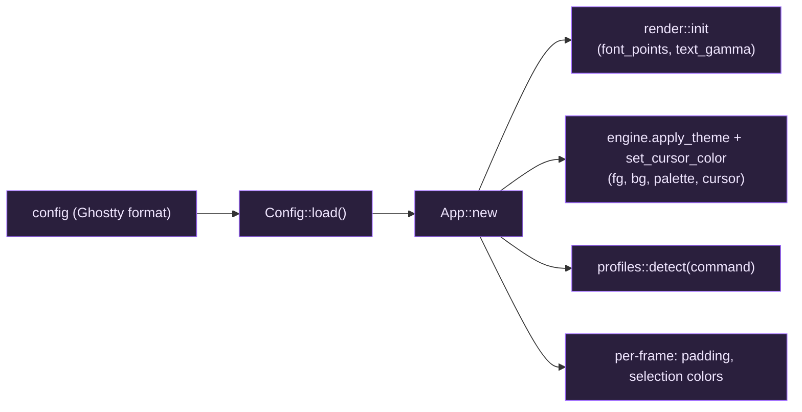

# Configuration

giest reads `%APPDATA%\giest\config` on startup. Override the path with the
`GIEST_CONFIG` environment variable. The file uses **Ghostty's config format**,
so keys are transposable with a real Ghostty config:

- `key = value`, one per line, **kebab-case** keys.
- Colors are **unquoted** hex: `background = #1d1f21` (a leading `#` is part of
  the color, not a comment).
- Lines whose first non-blank character is `#` are comments. Ghostty has no
  inline comments.
- `palette` is **repeatable** — one `palette = <index>=#rrggbb` line per entry.
- An **empty value** (`key =`) resets that key to its built-in default.
- **Every key is optional**, and keys giest doesn't support (e.g. `font-family`,
  `theme`) are ignored with a warning — so a full Ghostty config can be dropped
  in and the supported subset applies.

## Full annotated example

```ini
command          = pwsh        # default shell: name (pwsh/powershell/cmd/wsl) or
                               # a full path; unset auto-detects (PowerShell 7)
font-size        = 16          # logical font size (scaled by display DPI)
foreground       = #c5c8c6     # default text color
background       = #101218     # default background color
cursor-color     = #c5c8c6     # cursor color (omit to defer to the program)
window-padding-x = 2           # logical-point padding left/right of the grid
window-padding-y = 2           # logical-point padding above/below the grid
text-gamma       = 1.3         # text AA gamma; >1 thickens light-on-dark (0.5–3.0)

scrollback-limit = 10000       # max scrollback lines retained per pane

selection-background = #385a9c # selected-cell background
selection-foreground = #ffffff # text color over a selection (optional)
copy-on-select       = false   # copy to clipboard as soon as text is selected
right-click-action   = context-menu  # context-menu | copy | paste | copy-or-paste | ignore
middle-click-action  = primary-paste # primary-paste | ignore

# Palette overrides — repeat the key, one entry per line:
palette = 0=#101218
palette = 1=#cc6666
palette = 8=#666a73
```

## Field reference

| Key | Type | Effect |
| --- | --- | --- |
| `command` | string | Default shell: a profile name, program, or full path. Unknown values become a new default profile. (Ghostty `command`.) |
| `font-size` | float | Logical font size; scaled by DPI, then rasterized into the glyph atlas. Also the reset target for Ctrl+0. |
| `foreground` / `background` | `#rrggbb` | Default fg/bg, applied via `engine.apply_theme`. |
| `cursor-color` | `#rrggbb` | Cursor color; omit to defer to the program/engine default. |
| `window-padding-x` / `window-padding-y` | float | Per-pane inset in logical points (wraps every split, not just the window edge). Defaults to Ghostty's `2`; the scrollbar overlays rather than reserving space, so the padding doesn't have to make room for it. |
| `window-theme` | enum | Light/dark mode for the **chrome** (tab strip, command palette, overlays, dialogs): `auto` (default) derives it from `background`, so the chrome matches your terminal; `dark`/`light` force it. giest never follows the OS theme — that is what used to render a light tab strip over a dark terminal. Colors and accents come from `foreground`/`background`/`palette`, so a theme change restyles the chrome too. |
| `text-gamma` | float (0.5–3.0) | Anti-aliasing gamma passed to the shader; >1 thickens light-on-dark text. **giest-specific** — Ghostty has no equivalent. |
| `scrollback-limit` | int | Max scrollback **lines** retained per pane. Note: Ghostty's `scrollback-limit` is in *bytes*; giest's VT engine takes a line count, so the key matches but the unit differs. |
| `selection-background` | `#rrggbb` | Background of selected cells. |
| `selection-foreground` | `#rrggbb` | Text color over a selection (optional; omit to keep each cell's own fg). |
| `copy-on-select` | enum | `false` off; `true`/`clipboard`/`primary` copy on selection. Windows has no primary selection, so the three truthy values behave identically. |
| `right-click-action` | enum | What a right-click in a pane does: `context-menu` (default; Copy/Paste/Split/Select All/Reset), `copy`, `paste`, `copy-or-paste` (copy if a selection exists, else paste), or `ignore`. Suppressed while a program is capturing the mouse. |
| `middle-click-action` | enum | `primary-paste` (default) pastes the clipboard; `ignore` does nothing. Windows has no primary selection, so this reads the system clipboard. |
| `palette` | repeated `<index>=#rrggbb` | Override individual 256-color palette entries; everything else keeps the bundled theme. |

### Inline images (kitty graphics)

| Key | Type | Notes |
| --- | --- | --- |
| `image-storage-limit` | int (default `320000000`) | Bytes of image data retained per terminal screen. **Zero disables the image protocols and deletes everything stored.** Per screen, so the effective budget per pane is double. |

⚠️ **Inline images do not currently work on Windows.** ConPTY re-renders the shell's output rather
than passing it through, and drops the APC escape sequences the kitty protocol uses, so no image
command reaches the terminal. This affects every Windows terminal, not just giest. giest's engine
and rendering support is built and tested and will work once the PTY layer can deliver APC — see
GAP.md for the detail.

### Windows and working-directory inheritance

| Key | Type | Notes |
| --- | --- | --- |
| `window-inherit-working-directory` | bool (default `true`) | A new window (`Ctrl+Shift+N`) starts in the focused pane's directory, reported via OSC 7. |
| `tab-inherit-working-directory` | bool (default `true`) | Same for a new tab. |
| `split-inherit-working-directory` | bool (default `true`) | Same for a new split. |

Secondary windows share the first window's glyph atlas, so **font size is application-wide** — a
zoom in one window resizes them all (Ghostty's is per-surface). They also don't get the DWM acrylic
backdrop or the taskbar attention flash, which need a window handle only the first window has.

`close_window` has no default binding: Windows already delivers Alt+F4 to the window, which giest
answers with the close confirmation. Bind it explicitly with `keybind = alt+f4=close_window` if you
want the action as well.

### More bindable actions

Beyond the defaults, these Ghostty actions are available to `keybind`:

| Action | Notes |
| --- | --- |
| `clear_screen` | Clears the screen **and** the scrollback. |
| `copy_title_to_clipboard` | The shell-set title of the focused pane. |
| `toggle_readonly` | Stops keys reaching the shell. Scrolling, selection and copy still work — the point is a pane you can read without disturbing. |
| `move_tab:N` | Move the current tab N places; clamped at the ends, not wrapped. |
| `set_font_size:N` | Absolute size in points. A fractional value rounds. |
| `scroll_page_lines:N` | Scroll N lines (negative scrolls up). |
| `scroll_page_fractional:N` | Scroll N pages — `0.5` for half a screen. |
| `prompt_tab_title` | Opens the inline tab-rename box. |
| `quit` / `close_all_windows` | Close everything. |
| `equalize_splits` | Accepted as a no-op: giest's splits are always 50/50, so there is nothing to equalize. It binds without error so a Ghostty config transfers cleanly. |

Not available, because `Action` is a `Copy` type with no room for a string parameter:
`text:`, `csi:`, `esc:`, `set_tab_title:`, `set_surface_title:`.

### Window geometry

| Key | Type | Notes |
| --- | --- | --- |
| `window-width` | cells (default `0` = OS decides) | Initial window width in terminal **cells**, not pixels. Floored at 10 when set. |
| `window-height` | cells (default `0`) | Initial height in cells. Floored at 4. |
| `window-position-x` | pixels | Initial position from the primary monitor's top-left. Negative is fine — a monitor to the left has negative x. |
| `window-position-y` | pixels | **Both** x and y must be set, or neither applies (Ghostty's rule). |

All four apply to a **new window only**; resizing afterwards is yours. Three actions cover the rest:

```
keybind = ctrl+shift+m=toggle_maximize
keybind = ctrl+shift+a=toggle_window_float_on_top
keybind = ctrl+shift+b=toggle_background_opacity
```

Ghostty documents `toggle_maximize` as having no effect on macOS, and `toggle_window_float_on_top`
and `toggle_background_opacity` as macOS-only. Windows supports all three, so giest implements them
regardless of which side upstream leaves them on.

`toggle_background_opacity` flips between your configured `background-opacity` and fully opaque. It
needs a window that was *created* transparent (see the restart note under Transparency); on an
opaque window it tells you so rather than appearing to do nothing.

### Writing the terminal to a file

Three actions dump text to a temporary file, for when a scrollback is too big to
usefully select:

```
keybind = ctrl+shift+s=write_scrollback_file:open
keybind = ctrl+shift+g=write_screen_file:copy
keybind = ctrl+shift+y=write_selection_file:paste
```

`write_scrollback_file` captures everything (scrollback plus the viewport), `write_screen_file` just
what's visible, and `write_selection_file` the current selection — the last does nothing when
nothing is selected.

**The `copy`/`paste`/`open` parameter acts on the file *path*, not the contents.** That trips people
up, and it's the point of the design: `copy` puts the path on your clipboard, `paste` types it into
the shell so you can pipe it somewhere (`grep … <paste>`), and `open` hands the file to whatever
Windows uses for `.txt`. The parameter is required — there is no default.

Trailing spaces are stripped from every line, and the run of blank lines a mostly-empty screen
leaves at the end is dropped. Without that, a 200-column pane would emit 200 characters on every
line and every blank row would be a line of spaces.

### Mouse and scrolling

| Key | Type | Notes |
| --- | --- | --- |
| `mouse-hide-while-typing` | bool (default `false`) | Hide the pointer while typing; it reappears the moment the mouse moves. |
| `mouse-reporting` | bool (default `true`) | Whether programs may receive mouse events at all. `false` makes the mouse always select, whatever the program asks for. Toggle at runtime with the `toggle_mouse_reporting` action. |
| `mouse-scroll-multiplier` | number, or `precision:`/`discrete:` list (default `precision:1,discrete:3`) | Wheel-distance multiplier. A bare number sets both; `precision:0.1,discrete:3` sets them separately. Clamped to `0.01`–`10000`. |
| `scroll-to-bottom` | list (default `keystroke,no-output`) | When the viewport snaps to the live edge: `keystroke` on a key that sends data, `output` on new output. Negate with `no-`. |
| `focus-follows-mouse` | bool (default `false`) | Hovering a split focuses it, no click needed. |

Two devices, two multipliers: a notched wheel and a trackpad emit very different deltas, and one
number that suits either ruins the other — which is why Ghostty splits them and defaults the wheel
to `3` and the trackpad to `1`.

`scroll-to-bottom = output` is off by default on purpose: it fights you while you're reading
scrollback of a command that is still producing output.

`toggle_mouse_reporting` is the escape hatch for a full-screen program that has captured the
pointer — bind it (`keybind = ctrl+shift+m=toggle_mouse_reporting`) and you can select text without
quitting the program. It is per-pane, and a config reload re-applies `mouse-reporting`, discarding
the toggle.

`focus-follows-mouse` only moves focus when the pointer has actually *moved*. A parked cursor would
otherwise drag focus back every frame and make the `focus_split_*` keybinds unusable.

### Key sequences

A trigger may be several keys separated by `>`, giving tmux-style prefix bindings:

```
keybind = ctrl+a>n=new_tab
keybind = ctrl+a>w=close_surface
keybind = ctrl+a>|=new_split:right
```

Press the leader, then the next key. Three details worth knowing, all matching Ghostty:

- **The leader is reserved from the shell** while any sequence uses it. `ctrl+a` bound as a leader
  no longer reaches your programs — which is the point, and also why binding a key you use inside
  the terminal will surprise you.
- **A dead end is flushed, not eaten.** Type `ctrl+a` then a key that completes nothing, and *both*
  go to the shell. Nothing is silently swallowed.
- **An exact binding beats a prefix.** With both `ctrl+a` and `ctrl+a>n` bound, `ctrl+a` fires
  immediately rather than waiting for a second key that could never take effect.

`keybind = ctrl+a>n=unbind` removes one branch and leaves the others; once the last branch of a
leader is gone, the leader itself is released back to the shell.

### Bell, resize overlay, close confirmation

| Key | Type | Notes |
| --- | --- | --- |
| `bell-features` | list | Comma-separated `system`, `audio`, `attention`, `title`, `border`, each negatable with `no-`. Defaults to `attention,title` — **note `border` is off**, so the pane-border flash giest used to show by default now needs `bell-features = border`. A bare `true`/`false` sets every feature. A feature list starts from the defaults, so a second `bell-features` line *replaces* the first, and one unknown name rejects the whole value. |
| `bell-audio-path` | path | Sound file for `audio` (`.wav`); relative paths resolve against the config directory. |
| `bell-audio-volume` | float 0–1 | Parsed and stored but **not honored** — the Windows playback API has no volume parameter. |
| `resize-overlay` | enum | `after-first` (default), `always`, `never`. `after-first` suppresses the overlay on a surface's very first sizing, so new tabs and splits don't flash a size. |
| `resize-overlay-position` | enum | `center` (default), `top-left`, `top-center`, `top-right`, `bottom-left`, `bottom-center`, `bottom-right`. |
| `resize-overlay-duration` | duration | Default `750ms`. Accepts Ghostty's additive grammar (`1h30m`, `2s500ms`) and a bare integer as milliseconds; clamped to 250 ms – 60 s. |
| `confirm-close-surface` | enum | `true` (default) confirms only when a pane looks busy, `always` always confirms, `false` never does. Also guards the titlebar close / Alt+F4. "Busy" is inferred from OSC 133 prompt marks, which giest injects for PowerShell and cmd; a shell that doesn't mark its prompts can't be judged, so it always confirms. |
| `osc-color-report-format` | enum | Precision of replies to `OSC 10/11/12 ; ?` colour queries: `16-bit` (default), `8-bit`, or `none` to not answer. |
| `scrollbar` | enum | `system` (default) or `never`. See below. |
| `desktop-notifications` | bool (default `true`) | Whether programs may raise desktop notifications with `OSC 9` or `OSC 777`. See below. |
| `progress-style` | bool (default `true`) | Whether programs may drive a progress indicator with ConEmu's `OSC 9;4`. It shows on the **taskbar button**. See below. |
| `notify-on-command-finish` | `never` (default) \| `unfocused` \| `always` | Tell you when a long command finishes. Opt-in. See below. |
| `notify-on-command-finish-action` | list | How it tells you: `bell` (on by default) and `notify` (off), negatable with `no-`. A list starts from the defaults, so `notify` alone means *both*; write `no-bell,notify` for a toast only. |
| `notify-on-command-finish-after` | duration (default `5s`) | How long a command must have run to be worth reporting. `0` reports every command. Accepts the same additive grammar as `resize-overlay-duration` (`45s`, `1h30m`). |

### Progress on the taskbar button

A program reports progress with ConEmu's `OSC 9;4`, and giest shows it on the **Windows taskbar
button** — the same place ConEmu (which invented the sequence) and Windows Terminal put it. Ghostty
draws a bar inside its own window instead, which is the right answer on macOS and GTK and the wrong
one here.

```sh
printf '\033]9;4;1;40\033\\'   # 40% complete
printf '\033]9;4;3\033\\'      # busy, length unknown (marquee)
printf '\033]9;4;2\033\\'      # failed (red)
printf '\033]9;4;4;40\033\\'   # paused (yellow)
printf '\033]9;4;0\033\\'      # clear
```

Two details worth knowing:

- **A state change with no percentage keeps the last one.** `9;4;2` after `9;4;1;70` leaves the bar
  at 70 and turns it red, rather than snapping to zero or full — Windows has no "recolour in place"
  call, so the value is carried forward deliberately.
- **There is one taskbar button but many panes**, so the states are merged worst-news-first: a
  failure wins, then a pause, then indeterminate, and only then a percentage — the *lowest* of the
  running jobs, so the button reads "how far along is the slowest thing" instead of flickering
  between them.

`progress-style = false` ignores the sequences entirely.

### Command-finished notifications

`notify-on-command-finish = unfocused` is the useful setting: start a build, switch away, get told
when it lands — and stay undisturbed when you're already watching.

```
notify-on-command-finish = unfocused
notify-on-command-finish-action = no-bell,notify
notify-on-command-finish-after = 30s
```

This needs the shell to mark its commands with OSC 133, which giest injects for its built-in
PowerShell and Command Prompt profiles. **WSL and custom shells get nothing** unless they emit the
marks themselves, in which case they work automatically.

Two Windows-specific limits, neither of them fixable from the terminal side:

- **Command Prompt cannot report an exit code.** Its `prompt` string is expanded by the console, and
  there is no token for `%ERRORLEVEL%` at render time — so a cmd notification says "Command
  finished" with a duration and no pass/fail. PowerShell reports the real code, including a native
  program's (it consults `$?` *and* `$LASTEXITCODE`, because neither alone is right).
- **The clock starts when you press Enter**, not when the shell begins executing. The OSC 133 `C`
  mark exists for exactly this, but emitting one needs a pre-execution hook: PowerShell has none
  short of overriding a PSReadLine key handler, which isn't always loaded, and cmd has none at all.
  giest measures from the keystroke it sent instead, which is within microseconds of the real thing.
  A shell that *does* emit `C` overrides this automatically.

### Desktop notifications

A program can raise a notification two ways, both of which giest accepts:

```sh
printf '\033]9;Build finished\033\\'                 # iTerm2 form: body only
printf '\033]777;notify;make;done in 3m12s\033\\'    # rxvt form: title + body
```

They surface as Windows toasts. giest uses the notification-area (`Shell_NotifyIcon`) balloon API
rather than the modern WinRT toast API, because the latter requires the app to register an
*AppUserModelID* via a Start Menu shortcut — a permanent machine-wide side effect a portable
terminal shouldn't create. Windows 10 and 11 render those balloons as toasts anyway.

The consequence is one notification-area icon, added **lazily**: nothing appears in the tray until a
program actually notifies, and it is removed when giest exits. Notifications never make a sound —
that's the bell's job (`bell-features = system`), and doubling them up on anything that rings and
notifies together would be worse than either alone. Long titles and bodies are truncated with an
ellipsis (Windows' own limits are 63 and 255 characters, and it truncates silently otherwise).

`OSC 9` is overloaded: ConEmu claims `9;1` through `9;9` for unrelated commands (progress bars, tab
titles, working-directory reports), so a notification body that begins with one of those shapes is
interpreted as the ConEmu command instead. giest follows Ghostty's disambiguation exactly, including
the one genuinely lossy case — `\033]9;5…` is ConEmu's "wait for input" and is swallowed, so a
message starting with a bare `5` won't show. Start the body with anything else.

### Scrollbar

`system` gives each pane an **auto-hiding overlay** scrollbar: invisible at rest, fading in whenever
you scroll or when you hover a narrow band at the pane's right edge, and fading out about a second
later. Drag the thumb to scroll; click above or below it to page. Ghostty has exactly these two
values and no width/opacity/always knob, so neither does giest.

It never reserves space — the grid keeps every column it would otherwise have. At the default
`window-padding-x` of 2 that means the visible bar overlays the last column, which is what Ghostty's
scroller does too (its macOS apprt forces an overlay scroller even against the OS preference); the
knob is outlined so it stays legible over text. Raise `window-padding-x` past ~14 and the bar sits
entirely inside the padding instead, clear of the text. A click at the very edge still reaches the
terminal while the bar is hidden — only 4 pt is interactive then, and with hover-only sense. The bar
also hides itself while a full-screen program is capturing the mouse, since there's no scrollback to
point at.

`keybind = <chord>=scroll_to_row:N` scrolls so absolute row `N` is at the top. Ghostty leaves this
action unbound — it exists so the scrollbar can drive the terminal — but giest accepts it in a
keybind too.

Note the bell's `attention` feature flashes the taskbar button only while the window is unfocused,
and `title` prefixes the window title with 🔔 until you focus it again.

### Clipboard permissions and paste protection

| Key | Type | Notes |
| --- | --- | --- |
| `clipboard-paste-protection` | bool (default `true`) | Confirm before pasting text that could run as a command. |
| `clipboard-paste-bracketed-safe` | bool (default `true`) | Trust a program that has enabled bracketed paste to treat the text as data. |
| `clipboard-read` | enum (default `ask`) | Whether a program may *read* your clipboard via OSC 52. `allow` / `deny` / `ask`. |
| `clipboard-write` | enum (default `allow`) | Whether a program may *set* your clipboard via OSC 52. `allow` / `deny` / `ask`. |
| `clipboard-trim-trailing-spaces` | bool (default `true`) | Drop the padding spaces at the end of each copied line. |

**Why paste protection exists.** A shell runs a line the moment it sees a newline. Copy a
"helpful" one-liner from a web page and the newline hiding at the end of it means the command runs
before you can read what you pasted. With protection on, giest shows you the text first — control
characters made visible, so a payload can't disguise itself — and pastes nothing until you say
Allow.

A paste is considered unsafe when it contains a newline, or the byte sequence that *ends* a
bracketed paste. The second one is checked even when the program has enabled bracketed paste and
you've set `clipboard-paste-bracketed-safe = true`: a payload that closes the bracket itself
escapes the framing, so framing is exactly what can't be trusted there.

The dialog has no Enter-to-accept shortcut, on purpose — Escape denies, but allowing takes a
deliberate click.

**OSC 52.** Programs (tmux, vim, a remote shell over SSH) can set and read the system clipboard
through an escape sequence. Setting is allowed by default, matching Ghostty, since the worst case
is a clobbered clipboard. Reading defaults to `ask`, because it sends whatever you last copied —
passwords included — to whatever is running in that pane, possibly on another machine. Set
`clipboard-read = deny` to refuse silently, which is what giest did unconditionally before these
keys existed.

### Transparency and opacity

| Key | Type | Notes |
| --- | --- | --- |
| `background-opacity` | float 0–1 (default `1.0`) | Window background opacity. Only cells left on the *default* background go translucent — a program that paints its own background (Neovim, tmux) stays opaque by design. **Changing this across the `1.0` boundary needs a restart**: whether the window can be transparent at all is fixed when the surface is created. The value itself reloads live. |
| `background-opacity-cells` | bool (default `false`) | Extend `background-opacity` to cells that set an explicit background too. Selected and reverse-video cells stay opaque regardless. |
| `unfocused-split-opacity` | float 0.15–1 (default `0.7`) | Dim unfocused splits so the focused one stands out; `1.0` disables. Values below `0.15` clamp up (Ghostty's rule — a fully invisible split looks broken). |
| `unfocused-split-fill` | color | Color of the dimming overlay; defaults to the pane's background. |
| `cursor-opacity` | float 0–1 (default `1.0`) | Applies to a focused pane's cursor. An unfocused pane's hollow cursor stays opaque. |
| `faint-opacity` | float 0–1 (default `0.5`) | Opacity of faint/dim (SGR 2) text. |
| `background-blur` | `false` \| `true` \| int | Windows DWM backdrop behind a translucent window. `true` (= intensity 20) and any intensity ≥ 10 select **acrylic**; 1–9 select the subtler **mica**. Note `0`/`1` parse as booleans, so `background-blur = 1` means *true*, not radius 1. `macos-glass-regular`/`-clear` are accepted and treated as `true`. |

### Custom shaders

| Key | Type | Notes |
| --- | --- | --- |
| `custom-shader` | path (**repeatable**) | A Shadertoy-format GLSL fragment shader applied to the whole terminal. Repeat the key to chain several; they run in the order given. A relative path resolves against the config directory. |
| `custom-shader-animation` | `true` (default) \| `false` \| `always` | Keep redrawing so the shader animates. `true` animates only while the window is focused; `always` animates unfocused too, at a real CPU cost per window. |

Write the shader exactly as you would on [shadertoy.com](https://shadertoy.com) — define
`void mainImage(out vec4 fragColor, in vec2 fragCoord)` and read the `i*` uniforms. `iChannel0` is
the terminal itself, so a pass-through is:

```glsl
void mainImage(out vec4 fragColor, in vec2 fragCoord) {
    fragColor = texture(iChannel0, fragCoord / iResolution.xy);
}
```

Ghostty's extra uniforms are all present too — `iCurrentCursor`, `iCursorColor`, `iBackgroundColor`,
`iFocus`, the `CURSORSTYLE_*` constants and the rest — so a shader written for Ghostty runs here
unchanged.

Two things to know:

- **A shader that fails to compile is reported and skipped, not fatal.** The GLSL compiler's own
  message, with line numbers, goes to stderr; the terminal renders normally. Ghostty behaves the
  same way.
- **`fragCoord.y == 0` is the top of the screen, not the bottom.** This matches Ghostty (and WGSL,
  and Metal), but *not* shadertoy.com, which is Y-up. A shader ported straight from Shadertoy will
  have any vertical asymmetry mirrored — on Ghostty as well as here. Flip `uv.y` if it matters.

`iChannelTime` is a `vec4` rather than a `float[4]`; it indexes the same way, and giest has no media
channels for it to describe anyway.

### Background image

| Key | Type | Notes |
| --- | --- | --- |
| `background-image` | path | A **PNG or JPEG** painted behind the grid. A relative path resolves against the config file's directory (same rule as `bell-audio-path`). The format is detected from the file's contents, not its extension. Unset by default. |
| `background-image-opacity` | float ≥ 0 (default `1.0`) | Opacity of the image *relative to* `background-opacity`. `1.0` lays the image over the background color and then applies `background-opacity` to the pair; below `1.0` mixes it into the color first. **Values above `1.0` are meaningful**: with `background-opacity = 0.5`, an image opacity of `1.5` gives the image an effective `0.75`. |
| `background-image-position` | `top-left` \| `top-center` \| `top-right` \| `center-left` \| `center` \| `center-right` \| `bottom-left` \| `bottom-center` \| `bottom-right` (default `center`) | Where the image sits when its fit leaves space. `center-center` is accepted as a synonym for `center`. |
| `background-image-fit` | `contain` \| `cover` \| `stretch` \| `none` (default `contain`) | `contain` scales to the largest size fully inside the window; `cover` to the smallest that covers it (cropping the overflow); `stretch` fills exactly, ignoring aspect ratio; `none` uses the image's own pixel size. |
| `background-image-repeat` | bool (default `false`) | Tile the image to fill whatever space the fit leaves. |

The image covers the terminal area (everything below the tab strip), **once per window** —
splits and tabs share it rather than each repeating it, which is the limitation Ghostty
documents for its own per-terminal implementation. It is drawn behind the cell backgrounds,
so text and any program-painted background sit on top of it.

With an image configured, the image pass paints the window background color *itself* and
`background-opacity` applies to the composite — so the two keys interact exactly as they do
in Ghostty, and the image never double-darkens the window. All five keys reload live
(`Reload Config`); only turning transparency on or off still needs a restart.

Windows has no blur-*radius* control — DWM's backdrops are fixed-strength — so unlike
macOS/KDE, where Ghostty's number is a real Gaussian sigma, here the intensity only picks
*which* backdrop to use. Blur also needs something to see through: it has no visible effect
at `background-opacity = 1`, and giest warns at startup if you configure that combination.

## How a value reaches the screen



## Runtime adjustments (no config edit)

| Keys | Effect |
| --- | --- |
| Ctrl+= / Ctrl+- | grow / shrink the font (re-rasterizes the atlas) |
| Ctrl+0 | reset the font to `font-size` |

Font bounds are clamped to 6–48 logical points.
