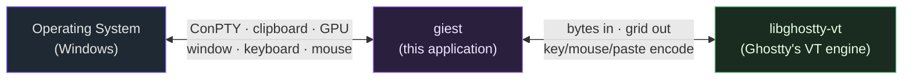

# giest

**giest** is a GPU-accelerated terminal emulator for **Windows**, written in
Rust. [eframe](https://github.com/emilk/egui/tree/master/crates/eframe)
(egui + wgpu) owns the window; the terminal grid is drawn by a custom wgpu
glyph-atlas pipeline; the terminal state lives in
**[libghostty-vt](https://ghostty.org)** (Ghostty's VT engine) behind a
backend-agnostic trait; the shell runs over **ConPTY**.

> **North-star goal:** feature parity with the macOS Ghostty app.

## What this documentation covers

This site documents the giest application and — most importantly — the
**touch points** between the three systems it stitches together:

- **[Architecture](architecture/overview.md)** — the layered design and how a
  byte travels from the shell to the screen and back.
- **[OS / libghostty touch points](touchpoints/overview.md)** — every place
  giest crosses a boundary into Windows or into libghostty-vt.
- **[Components](components/app.md)** — a page per source module.
- **[Guides](guides/building.md)** — building, testing, and configuring.
- **[Gotchas](gotchas.md)** — the non-obvious, platform-specific traps.

## At a glance

| Concern | Owner | Source |
| --- | --- | --- |
| Window, input events, GPU surface | eframe (egui + wgpu) | `app.rs`, `main.rs` |
| Terminal state (parser, grid, modes) | libghostty-vt | `engine/ghostty_vt.rs` |
| Backend-neutral terminal contract | giest | `engine/mod.rs` |
| Shell process + I/O | ConPTY via portable-pty | `pty.rs` |
| Per-session glue (selection, OSC 52) | giest | `session.rs` |
| Glyph atlas + instanced-quad renderer | giest + wgpu | `render/mod.rs`, `render/atlas.rs` |
| Config, shell profiles, clipboard | giest + Windows | `config.rs`, `profiles.rs`, `clipboard.rs` |

## Status

A daily-usable GPU-rendered terminal: live output, truecolor + styles,
mode-aware keyboard input, mouse reporting, window-fit grid, scrollback, tabs,
selectable shell profiles (pwsh / cmd / WSL), split panes, text selection +
clipboard (incl. OSC 52), ligatures, system font fallback, and color emoji.
See the [roadmap in the README](https://github.com/stvnksslr/giest#roadmap-toward-macos-ghostty-parity)
for the remaining gaps toward macOS Ghostty parity.
