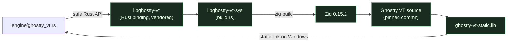
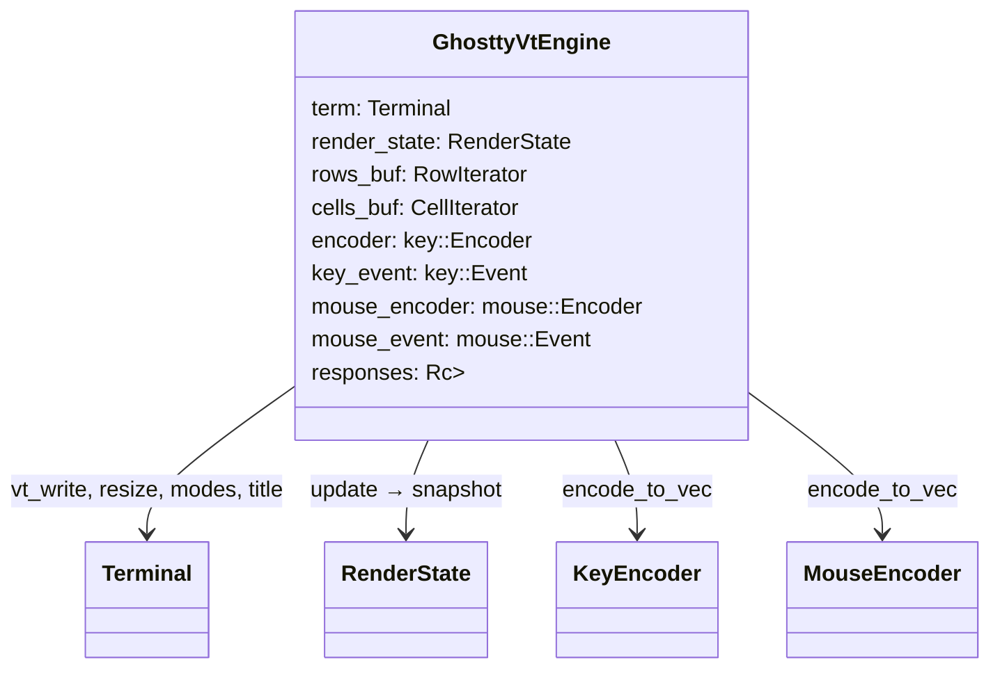
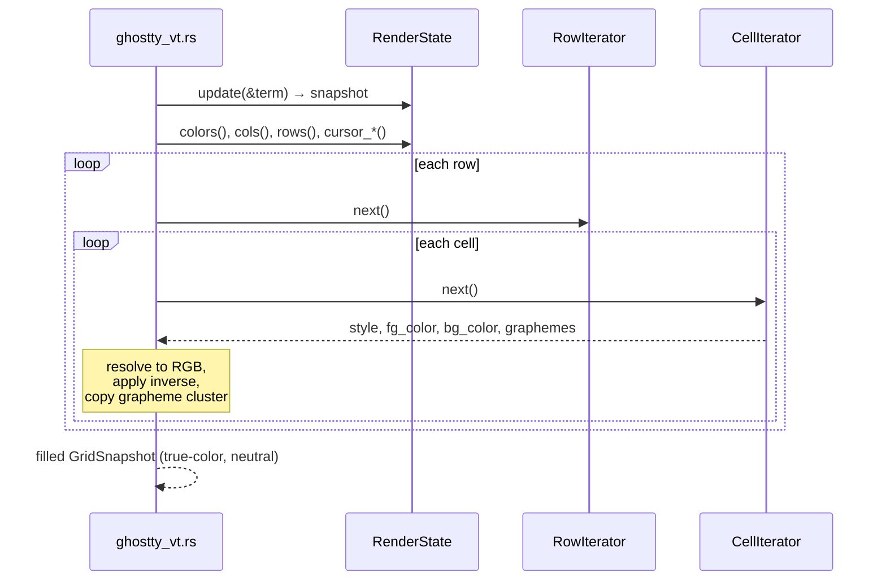
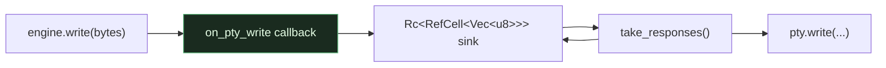

# Touch point: libghostty-vt

[libghostty-vt](https://ghostty.org) is Ghostty's terminal-state engine — the
VT parser, the grid, the scrollback, the mode state machine, and the
key/mouse/paste encoders. giest uses it as the **terminal model** behind the
[`TerminalEngine`](../components/engine.md) trait.

!!! info "The boundary lives in exactly one file"
    Every `use libghostty_vt::…` in the codebase is in
    **`engine/ghostty_vt.rs`**. Nothing else — not the renderer, not `app.rs`,
    not `session.rs` — references libghostty types. That file is the entire
    surface area of this touch point.

## How it's linked

- `vendor/libghostty-rs/` is a **vendored** copy of
  [Uzaaft/libghostty-rs](https://github.com/Uzaaft/libghostty-rs) (`@9bf2bd29`),
  depended on by path to apply **one patch**: on Windows, link the real static
  archive `ghostty-vt-static.lib` instead of the DLL import lib — otherwise the
  exe depends on `ghostty-vt.dll`, whose runtime path crashes in `vt_write`. See
  [Gotchas](../gotchas.md).
- `libghostty-vt-sys/build.rs` runs `zig build` against the pinned Ghostty
  commit, which declares `minimum_zig_version = 0.15.2` — **0.16.x will not
  build it**.

## What crosses the boundary

`GhosttyVtEngine` holds these libghostty objects and reuses them across calls
(no per-call allocation of encoders/iterators):

### Bytes in (parsing)

| `TerminalEngine` method | libghostty call |
| --- | --- |
| `write(bytes)` | `term.vt_write(bytes)` |
| `resize(cols, rows, cell_px)` | `term.resize(cols, rows, w, h)` |
| `scroll` / `scroll_to_bottom` / `scroll_to_top` | `term.scroll_viewport(ScrollViewport::…)` |
| `apply_theme(fg, bg, palette)` | `set_default_fg_color` / `set_default_bg_color` / `set_default_color_palette` |
| `set_cursor_color` | `term.set_default_cursor_color` |
| `is_mouse_tracking` | `term.is_mouse_tracking()` |

### Encoding out (input → bytes)

| Method | libghostty call | Notes |
| --- | --- | --- |
| `encode_key(KeyInput)` | `encoder.set_options_from_terminal(&term)` then `encoder.encode_to_vec` | Reads **live modes**: cursor-key application, keypad, kitty keyboard, modifyOtherKeys. |
| `encode_mouse(MouseInput)` | `mouse_encoder.set_options_from_terminal + set_size` then `encode_to_vec` | Fed cell/screen pixel sizes + pointer position; emits X10/SGR per the app's mode. |
| `encode_paste(text)` | `term.mode(Mode::BRACKETED_PASTE)` + `paste::encode` | Wraps in `ESC[200~ … ESC[201~` if mode 2004 is on, else normalizes `\n`→`\r`. |

### Grid out (snapshot)

`snapshot(&mut GridSnapshot)` is where libghostty's internal grid becomes
giest's neutral cells:

The engine **resolves palette indices and default fg/bg to concrete RGB** and
**pre-applies `inverse`** here, so everything above the trait deals only in true
color.

### Responses back to the PTY

libghostty answers some sequences (device-status reports, etc.) by writing bytes
back. It does this via the `on_pty_write` callback, which **must not re-enter the
terminal**, so giest's callback only pushes the bytes into a shared
`Rc<RefCell<Vec<u8>>>` sink. `take_responses()` drains that sink after each
`write`, and `session::pump_pty` flushes it to the PTY.

## What giest deliberately does *not* use from libghostty

- **OSC 52 payloads.** The binding surfaces only the OSC 52 *command type*, not
  its base64 body, and offers no callback. So giest runs its **own** side-stream
  parser ([`osc52.rs`](../components/osc52.md)) over the same bytes it feeds the
  engine. This is the one place terminal-protocol parsing is duplicated outside
  libghostty, and it exists purely because the binding doesn't expose the data.
- **OSC 8 hyperlinks.** Not yet surfaced per-cell by the binding; giest
  auto-detects URLs in the snapshot text instead (see
  [`session::find_url_at`](../components/session.md)).
