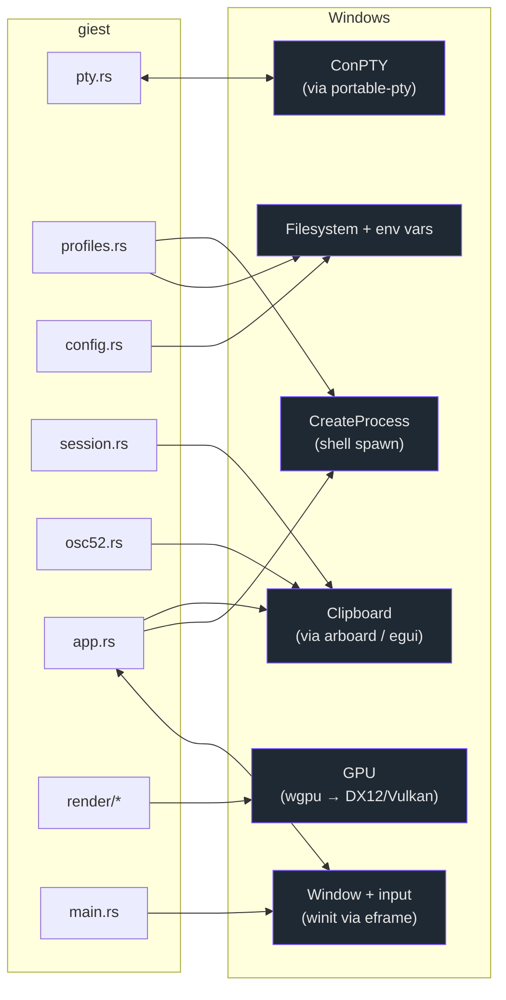
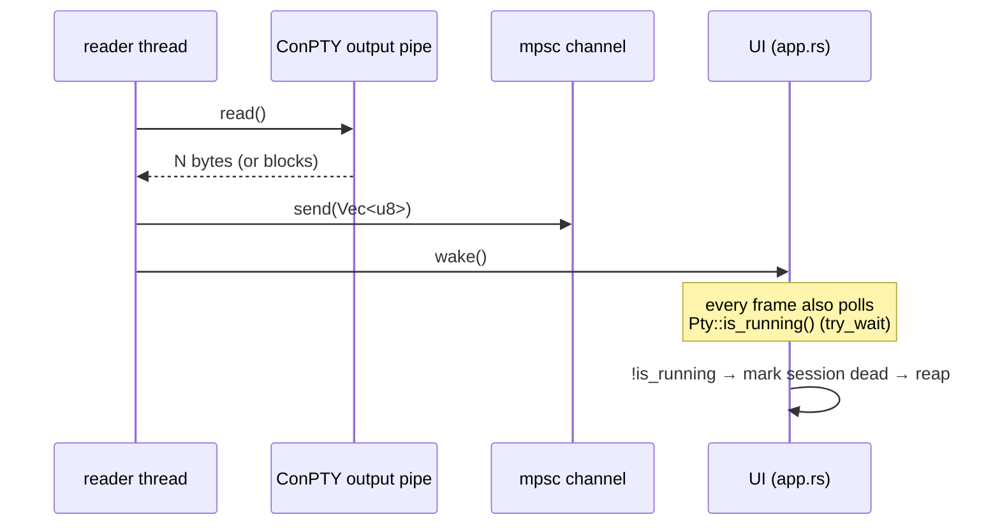
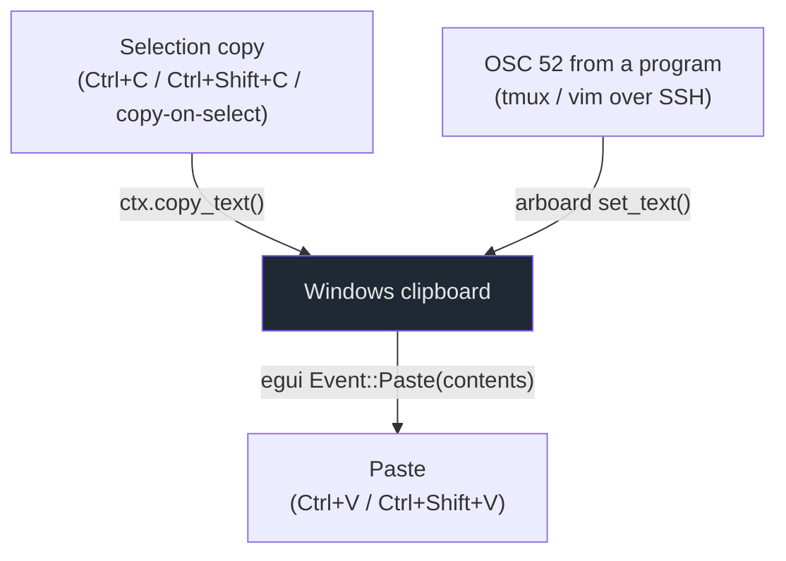

# Touch point: the operating system (Windows)

Every place giest crosses into Windows. giest targets Windows specifically — the
PTY transport is ConPTY, the clipboard and process-spawn behavior assume
Windows, and several gotchas exist only because of how ConPTY behaves.

## 1 · ConPTY — the pseudo-console

**Where:** `pty.rs` (the *only* file that touches the PTY).
**How:** [`portable-pty`](https://crates.io/crates/portable-pty)'s
`native_pty_system()`, which wraps ConPTY on Windows.

| Operation | Call | Notes |
| --- | --- | --- |
| Open a PTY | `pty_system.openpty(PtySize { rows, cols, … })` | Pixel size left 0; libghostty handles pixel-aware protocols. |
| Spawn the shell | `pair.slave.spawn_command(cmd)` | Then **drop the slave** so the child is the only holder of that end. |
| Read output | reader thread `Read::read(&mut reader, &mut buf)` | On its own thread; enqueues `Vec<u8>` and calls `wake()`. |
| Write input | `writer.write_all(bytes)` + `flush()` | Driven by `session.rs` from key/mouse/paste encodes and engine responses. |
| Resize | `master.resize(PtySize { … })` | Called alongside the engine resize when the grid changes. |
| Detect exit | `child.try_wait()` via `Pty::is_running` | **Critical:** see gotcha below. |

!!! warning "ConPTY does not reliably EOF on child exit"
    On Windows the master *output* pipe usually does **not** reach EOF when the
    child exits — portable-pty keeps the pseudoconsole open, so the reader
    thread stays blocked and its channel never disconnects. giest therefore
    detects exit by **polling the child process directly**
    (`Pty::is_running` → `Child::try_wait`), not by `read() == 0`. `app.rs` also
    calls `request_repaint_after(500ms)` so an idle exit still gets reaped.
    See [Gotchas](../gotchas.md).

## 2 · Process spawning

**Where:** `profiles.rs` (which shell to run), `pty.rs` (spawns it), `app.rs`
(opens URLs).

- **Shell detection** (`profiles::detect`): probes `PATH` with `which()` for
  `pwsh.exe` and `wsl.exe`; `powershell.exe` and `cmd.exe` are assumed always
  present. A `shell` config value can select or prepend a custom command.
- **Shell launch:** `CommandBuilder::new(program)` + args, spawned through the
  PTY slave.
- **Opening URLs** (`app::open_url`): `Command::new("explorer").arg(url)` —
  `explorer` routes `http/https/ftp/file` to the default handler without
  flashing a console window.

## 3 · Clipboard

Three distinct paths reach the Windows clipboard:

- **Copy** runs through egui (`ctx.copy_text`) from the `Event::Copy/Cut` arms
  in `session.rs`, because egui-winit pre-translates the clipboard shortcuts —
  see the [gotcha](../gotchas.md).
- **OSC 52 write** happens in `pump_pty` (which has no egui context), so it
  writes the clipboard directly via [`arboard`](https://crates.io/crates/arboard)
  in `session::write_clipboard`. OSC 52 *read/query* is intentionally **not**
  answered, to avoid leaking the clipboard to terminal output.
- **Paste** arrives as `Event::Paste(contents)` already containing the clipboard
  text; the engine wraps it in bracketed-paste markers if the app enabled mode
  2004.

## 4 · GPU

**Where:** `render/mod.rs` and `render/atlas.rs`, via
[`wgpu`](https://crates.io/crates/wgpu) (eframe's wgpu backend → DX12/Vulkan on
Windows). `main.rs` forces `eframe::Renderer::Wgpu`.

- A single `wgpu::RenderPipeline` draws **instanced quads** (cell backgrounds,
  glyphs, cursor). Persistent GPU resources live in egui's
  `callback_resources`.
- Glyphs are rasterized on the CPU (ab_glyph) into an **R8 coverage atlas**;
  color emoji (COLR/CPAL) are composited into a separate **RGBA atlas**.
- Each pane is one `PaneFrame`; all panes of the active tab are drawn in a
  single egui paint callback over a shared instance buffer.

See [render component](../components/render.md) for the pipeline detail.

## 5 · Window & input

**Where:** `main.rs` builds the `NativeOptions` (wgpu renderer, initial size,
title); `app.rs` consumes egui events and issues `ViewportCommand`s.

| Direction | What | Mechanism |
| --- | --- | --- |
| In | Keyboard, text, pointer, scroll, paste, copy/cut, focus, DPI | `ctx.input(...)` egui events (winit underneath) |
| Out | Window title (from OSC 0/2) | `ctx.send_viewport_cmd(ViewportCommand::Title(...))` |
| Out | Close window (last tab closed) | `ViewportCommand::Close` |
| Out | Schedule repaint (PTY wake, cursor blink, exit poll) | `request_repaint` / `request_repaint_after` |

## 6 · Filesystem & environment

- **Config:** `config.rs` reads `%APPDATA%\giest\config` (Ghostty-format,
  `key = value` lines), overridable with the `GIEST_CONFIG` env var.
- **PATH probing:** `profiles::which` splits `PATH` to find shells.
- **Window subsystem:** `main.rs` sets `windows_subsystem = "windows"` in
  release builds so launching the GUI doesn't open a console window.
