# Touch points: overview

giest is glue between three systems. This section enumerates **every boundary
crossing** — each place where giest code calls into the operating system or into
libghostty-vt, and each callback that comes back the other way. If you're trying
to understand "where does giest end and Windows/Ghostty begin?", start here.

```mermaid
flowchart TB
    subgraph os["Operating system — Windows"]
        direction LR
        conpty["ConPTY"]
        clip["Clipboard"]
        gpu["GPU / wgpu"]
        winwnd["Window · input"]
        fs["Filesystem · env"]
        proc["Process spawn"]
    end

    subgraph giest["giest"]
        direction LR
        ptyrs["pty.rs"]
        sessrs["session.rs"]
        osc["clipboard.rs"]
        apprs["app.rs"]
        renderrs["render/*"]
        cfg["config.rs / profiles.rs"]
        eng["engine/ghostty_vt.rs"]
    end

    subgraph vtlib["libghostty-vt"]
        term["Terminal"]
        kenc["key::Encoder"]
        menc["mouse::Encoder"]
        rstate["RenderState + iterators"]
        pasteenc["paste::encode"]
    end

    ptyrs <-->|openpty · read · write · resize · try_wait| conpty
    cfg -->|spawn_command| proc
    cfg -->|read config · PATH| fs
    sessrs -->|arboard set_text| clip
    osc -->|arboard set_text| clip
    apprs -->|copy_text / Paste| clip
    apprs -->|explorer URL| proc
    renderrs -->|wgpu pipeline · queue| gpu
    apprs <-->|egui events · viewport cmds| winwnd

    eng <-->|vt_write · resize · modes| term
    eng -->|encode_to_vec| kenc
    eng -->|encode_to_vec| menc
    eng -->|update · row/cell iters| rstate
    eng -->|encode| pasteenc

    classDef osc fill:#1f2933,stroke:#7c5cff,color:#e6e6e6
    classDef vtc fill:#1a2b1f,stroke:#5cba7c,color:#e6ffe6
    classDef appc fill:#2a1f3d,stroke:#a06cff,color:#f0e6ff
    class conpty,clip,gpu,winwnd,fs,proc osc
    class term,kenc,menc,rstate,pasteenc vtc
    class ptyrs,sessrs,osc,apprs,renderrs,cfg,eng appc
```

## Two boundaries, two pages

| Boundary | What crosses it | Page |
| --- | --- | --- |
| **giest ↔ Windows** | PTY I/O, process spawning, clipboard, GPU, window/input, filesystem/env | [Operating system](os.md) |
| **giest ↔ libghostty-vt** | VT bytes, key/mouse/paste encoding, render snapshots, modes, theming | [libghostty-vt](libghostty.md) |

## The one rule that shapes everything

> The renderer and input layer **never** touch libghostty-vt directly. They go
> through the [`TerminalEngine`](../components/engine.md) trait.

That means the libghostty boundary is physically confined to a single file —
`engine/ghostty_vt.rs`. Every `use libghostty_vt::…` in the entire codebase
lives there. Similarly, the ConPTY boundary is confined to `pty.rs`, and the
clipboard boundary to `clipboard.rs` + the `Event::Copy/Cut/Paste` arms. This makes
each touch point auditable in one place.
